<h1 align="center">Awesome Codex Pets</h1>

<p align="center">
  <em>A community-curated gallery of <strong>174+ animated pets</strong> for the <a href="https://github.com/openai/codex">OpenAI Codex CLI</a>.</em>
</p>

<p align="center">
  <a href="https://codex-pet.com"><strong>codex-pet.com</strong></a>
  &nbsp;·&nbsp;
  <a href="https://codex-pet.com/submit">Submit a pet</a>
  &nbsp;·&nbsp;
  <a href="https://www.npmjs.com/package/codex-pet-cli">codex-pet-cli on npm</a>
</p>

<p align="center">
  Browse the live gallery, animation previews, and one-click installs at
  <a href="https://codex-pet.com"><strong>codex-pet.com</strong></a>.
</p>

---

## Install

Pick a pet from the [gallery](#gallery) below and run:

```bash
npx codex-pet-cli add <slug>
```

The CLI drops the sprite and `pet.json` into `~/.codex/pets/<slug>/` so the
[Codex CLI](https://github.com/openai/codex) picks it up on next launch.

Prefer a manual install? Each pet page has a **Download .zip** button:

```bash
curl -L -o my-pet.zip https://codex-pet.com/api/download/<slug>
unzip my-pet.zip -d ~/.codex/pets/
```

Full per-pet previews — every animation state, tags, and credits — live at
**[codex-pet.com/pets/&lt;slug&gt;](https://codex-pet.com)**.

## Submit your own pet

Designed a pet you want shipped to thousands of Codex users? Submit it at
**[codex-pet.com/submit](https://codex-pet.com/submit)** — sprites are reviewed within a
couple of days and added to both this list and the live gallery.

## Gallery

Click any pet to open its detail page on **[codex-pet.com](https://codex-pet.com)** with the
full animated preview and install command.

| &nbsp; | &nbsp; | &nbsp; | &nbsp; | &nbsp; |
| :---: | :---: | :---: | :---: | :---: |
| <a href="https://codex-pet.com/pets/academicasi-2"><br><sub><b>AcademicASI</b></sub></a> | <a href="https://codex-pet.com/pets/acidling"><br><sub><b>Acidling</b></sub></a> | <a href="https://codex-pet.com/pets/aku"><br><sub><b>Aku</b></sub></a> | <a href="https://codex-pet.com/pets/apu-apustaja"><br><sub><b>Apu Apustaja</b></sub></a> | <a href="https://codex-pet.com/pets/awawa-hyrax-2"><br><sub><b>Awawa Hyrax</b></sub></a> |
| <a href="https://codex-pet.com/pets/axel"><br><sub><b>Axel</b></sub></a> | <a href="https://codex-pet.com/pets/axobotl"><br><sub><b>Axobotl</b></sub></a> | <a href="https://codex-pet.com/pets/axobotl-2"><br><sub><b>Axobotl</b></sub></a> | <a href="https://codex-pet.com/pets/banani"><br><sub><b>Banani</b></sub></a> | <a href="https://codex-pet.com/pets/barry"><br><sub><b>Barry</b></sub></a> |
| <a href="https://codex-pet.com/pets/bernie"><br><sub><b>Bernie</b></sub></a> | <a href="https://codex-pet.com/pets/blade"><br><sub><b>Blade</b></sub></a> | <a href="https://codex-pet.com/pets/blau"><br><sub><b>Blau</b></sub></a> | <a href="https://codex-pet.com/pets/boba"><br><sub><b>Boba</b></sub></a> | <a href="https://codex-pet.com/pets/boba-2"><br><sub><b>Boba</b></sub></a> |
| <a href="https://codex-pet.com/pets/bolt"><br><sub><b>Bolt</b></sub></a> | <a href="https://codex-pet.com/pets/bonzibuddy"><br><sub><b>BonziBuddy</b></sub></a> | <a href="https://codex-pet.com/pets/boxcat"><br><sub><b>Boxcat</b></sub></a> | <a href="https://codex-pet.com/pets/buff-patrick"><br><sub><b>Buff Patrick</b></sub></a> | <a href="https://codex-pet.com/pets/byte-bunny"><br><sub><b>Byte Bunny</b></sub></a> |
| <a href="https://codex-pet.com/pets/cache-capy"><br><sub><b>Cache Capy</b></sub></a> | <a href="https://codex-pet.com/pets/caesar"><br><sub><b>Caesar</b></sub></a> | <a href="https://codex-pet.com/pets/calcifer"><br><sub><b>Calcifer</b></sub></a> | <a href="https://codex-pet.com/pets/calico"><br><sub><b>Calico</b></sub></a> | <a href="https://codex-pet.com/pets/cannibals"><br><sub><b>Cannibals</b></sub></a> |
| <a href="https://codex-pet.com/pets/cash-cuy"><br><sub><b>Cash Cuy</b></sub></a> | <a href="https://codex-pet.com/pets/chef"><br><sub><b>Chef</b></sub></a> | <a href="https://codex-pet.com/pets/chikny"><br><sub><b>Chikny</b></sub></a> | <a href="https://codex-pet.com/pets/chillhouse"><br><sub><b>chillhouse</b></sub></a> | <a href="https://codex-pet.com/pets/chirayu"><br><sub><b>Chirayu</b></sub></a> |
| <a href="https://codex-pet.com/pets/cinder"><br><sub><b>Cinder</b></sub></a> | <a href="https://codex-pet.com/pets/clawdex"><br><sub><b>Clawdex</b></sub></a> | <a href="https://codex-pet.com/pets/clippy"><br><sub><b>Clippy</b></sub></a> | <a href="https://codex-pet.com/pets/cloudlet"><br><sub><b>Cloudlet</b></sub></a> | <a href="https://codex-pet.com/pets/cogwick"><br><sub><b>Cogwick</b></sub></a> |
| <a href="https://codex-pet.com/pets/cosmo"><br><sub><b>Crafternauta</b></sub></a> | <a href="https://codex-pet.com/pets/crt-pal"><br><sub><b>CRT Pal</b></sub></a> | <a href="https://codex-pet.com/pets/crumbly"><br><sub><b>Crumbly</b></sub></a> | <a href="https://codex-pet.com/pets/cyberholk"><br><sub><b>Cyberholk</b></sub></a> | <a href="https://codex-pet.com/pets/daisy"><br><sub><b>Daisy</b></sub></a> |
| <a href="https://codex-pet.com/pets/danny"><br><sub><b>Danny</b></sub></a> | <a href="https://codex-pet.com/pets/daodun"><br><sub><b>DaoDun</b></sub></a> | <a href="https://codex-pet.com/pets/denissexy-itier"><br><sub><b>Denissexy ITier</b></sub></a> | <a href="https://codex-pet.com/pets/dobby">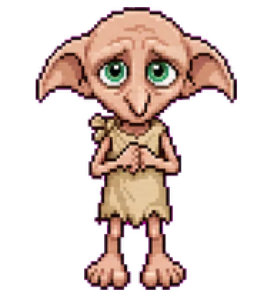<br><sub><b>Dobby</b></sub></a> | <a href="https://codex-pet.com/pets/dobby-2">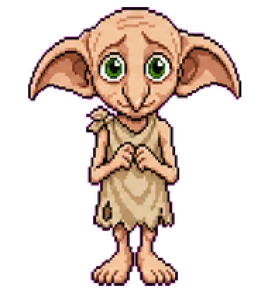<br><sub><b>Dobby</b></sub></a> |
| <a href="https://codex-pet.com/pets/doraemon"><br><sub><b>Doraemon</b></sub></a> | <a href="https://codex-pet.com/pets/drizz"><br><sub><b>Drizz</b></sub></a> | <a href="https://codex-pet.com/pets/dude"><br><sub><b>Dude</b></sub></a> | <a href="https://codex-pet.com/pets/duo"><br><sub><b>Duo</b></sub></a> | <a href="https://codex-pet.com/pets/eddy-3"><br><sub><b>Eddy</b></sub></a> |
| <a href="https://codex-pet.com/pets/einstein"><br><sub><b>Einstein</b></sub></a> | <a href="https://codex-pet.com/pets/elfie"><br><sub><b>Elfie</b></sub></a> | <a href="https://codex-pet.com/pets/elon"><br><sub><b>Elon</b></sub></a> | <a href="https://codex-pet.com/pets/exec"><br><sub><b>Exec</b></sub></a> | <a href="https://codex-pet.com/pets/aiso-feather"><br><sub><b>Feather</b></sub></a> |
| <a href="https://codex-pet.com/pets/february">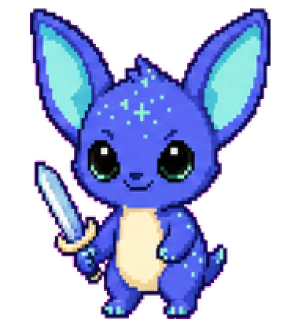<br><sub><b>February</b></sub></a> | <a href="https://codex-pet.com/pets/feynman"><br><sub><b>Feynman</b></sub></a> | <a href="https://codex-pet.com/pets/finderguy"><br><sub><b>Finder Guy</b></sub></a> | <a href="https://codex-pet.com/pets/foxat"><br><sub><b>Foxat</b></sub></a> | <a href="https://codex-pet.com/pets/friday"><br><sub><b>Friday</b></sub></a> |
| <a href="https://codex-pet.com/pets/ganesh"><br><sub><b>Ganesh</b></sub></a> | <a href="https://codex-pet.com/pets/geats">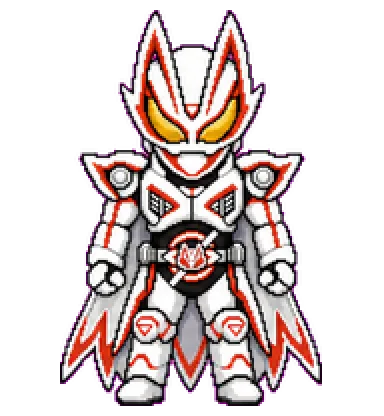<br><sub><b>GEATS</b></sub></a> | <a href="https://codex-pet.com/pets/ghostface"><br><sub><b>Ghostface</b></sub></a> | <a href="https://codex-pet.com/pets/goblin"><br><sub><b>Goblin</b></sub></a> | <a href="https://codex-pet.com/pets/goblin-sama"><br><sub><b>Goblin Sama</b></sub></a> |
| <a href="https://codex-pet.com/pets/goku-blue"><br><sub><b>Goku Blue</b></sub></a> | <a href="https://codex-pet.com/pets/grace-ashcroft-blue-variant"><br><sub><b>Grace Ashcroft (Blue Variant)</b></sub></a> | <a href="https://codex-pet.com/pets/gukegare">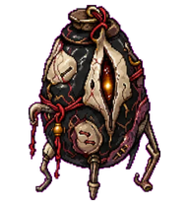<br><sub><b>Gûkegare</b></sub></a> | <a href="https://codex-pet.com/pets/gutsy">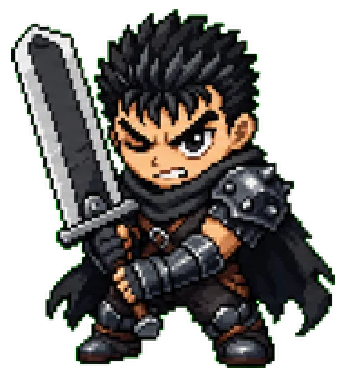<br><sub><b>Gutsy</b></sub></a> | <a href="https://codex-pet.com/pets/hannah-montana"><br><sub><b>Hannah Montana</b></sub></a> |
| <a href="https://codex-pet.com/pets/happy-cat"><br><sub><b>Happy Cat</b></sub></a> | <a href="https://codex-pet.com/pets/harry-poptart"><br><sub><b>Harry Poptart</b></sub></a> | <a href="https://codex-pet.com/pets/itachi"><br><sub><b>Itachi</b></sub></a> | <a href="https://codex-pet.com/pets/java"><br><sub><b>Java</b></sub></a> | <a href="https://codex-pet.com/pets/jeeves"><br><sub><b>Jeeves</b></sub></a> |
| <a href="https://codex-pet.com/pets/jesus"><br><sub><b>Jesus</b></sub></a> | <a href="https://codex-pet.com/pets/jiro"><br><sub><b>jiro</b></sub></a> | <a href="https://codex-pet.com/pets/aka-shiba"><br><sub><b>July</b></sub></a> | <a href="https://codex-pet.com/pets/junie">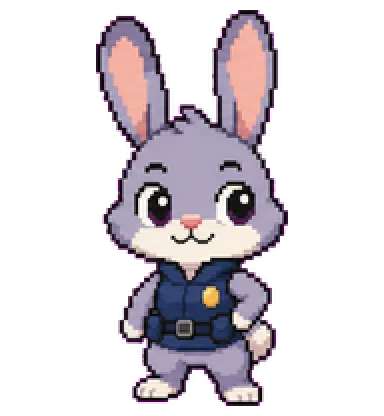<br><sub><b>Junie</b></sub></a> | <a href="https://codex-pet.com/pets/justin-bieber"><br><sub><b>Justin Bieber</b></sub></a> |
| <a href="https://codex-pet.com/pets/kasumi"><br><sub><b>Kasumi</b></sub></a> | <a href="https://codex-pet.com/pets/kebo"><br><sub><b>Kebo</b></sub></a> | <a href="https://codex-pet.com/pets/kibshi"><br><sub><b>KIBSHI</b></sub></a> | <a href="https://codex-pet.com/pets/kumakichi-0"><br><sub><b>kumakichi</b></sub></a> | <a href="https://codex-pet.com/pets/kurisu"><br><sub><b>Kurisu</b></sub></a> |
| <a href="https://codex-pet.com/pets/kuro">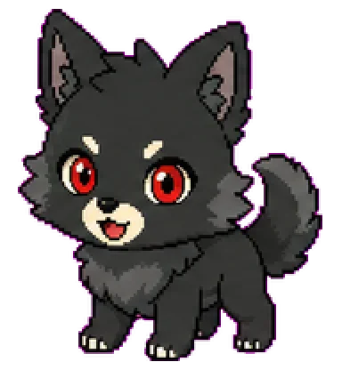<br><sub><b>Kuro</b></sub></a> | <a href="https://codex-pet.com/pets/kwehlet">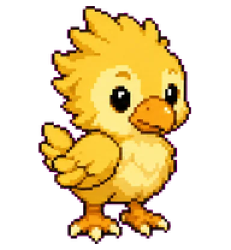<br><sub><b>Kwehlet</b></sub></a> | <a href="https://codex-pet.com/pets/lain"><br><sub><b>Lain</b></sub></a> | <a href="https://codex-pet.com/pets/lampy"><br><sub><b>Lampy</b></sub></a> | <a href="https://codex-pet.com/pets/leafspark"><br><sub><b>Leafspark</b></sub></a> |
| <a href="https://codex-pet.com/pets/lewis"><br><sub><b>Lewis</b></sub></a> | <a href="https://codex-pet.com/pets/luffy"><br><sub><b>Luffy</b></sub></a> | <a href="https://codex-pet.com/pets/luffy-2"><br><sub><b>Luffy</b></sub></a> | <a href="https://codex-pet.com/pets/macintosh"><br><sub><b>Macintosh</b></sub></a> | <a href="https://codex-pet.com/pets/maddie"><br><sub><b>Maddie</b></sub></a> |
| <a href="https://codex-pet.com/pets/masked-manager"><br><sub><b>Masked Manager</b></sub></a> | <a href="https://codex-pet.com/pets/max"><br><sub><b>Max</b></sub></a> | <a href="https://codex-pet.com/pets/max-3"><br><sub><b>Max</b></sub></a> | <a href="https://codex-pet.com/pets/meridian"><br><sub><b>Meridian</b></sub></a> | <a href="https://codex-pet.com/pets/mettaur"><br><sub><b>Mettaur</b></sub></a> |
| <a href="https://codex-pet.com/pets/mi-mo"><br><sub><b>Mi-Mo</b></sub></a> | <a href="https://codex-pet.com/pets/midudev"><br><sub><b>midudev</b></sub></a> | <a href="https://codex-pet.com/pets/mini-dark-lord"><br><sub><b>Mini Dark Lord</b></sub></a> | <a href="https://codex-pet.com/pets/mini-elon"><br><sub><b>Mini Elon</b></sub></a> | <a href="https://codex-pet.com/pets/mini-sama"><br><sub><b>Mini Sama</b></sub></a> |
| <a href="https://codex-pet.com/pets/miraculix"><br><sub><b>Miraculix</b></sub></a> | <a href="https://codex-pet.com/pets/miss-minute"><br><sub><b>Miss Minute</b></sub></a> | <a href="https://codex-pet.com/pets/mochi"><br><sub><b>Mochi</b></sub></a> | <a href="https://codex-pet.com/pets/mog"><br><sub><b>Mog</b></sub></a> | <a href="https://codex-pet.com/pets/mysterious-dancing-man"><br><sub><b>Mysterious Dancing Man</b></sub></a> |
| <a href="https://codex-pet.com/pets/nene"><br><sub><b>Nene</b></sub></a> | <a href="https://codex-pet.com/pets/nezuko"><br><sub><b>Nezuko</b></sub></a> | <a href="https://codex-pet.com/pets/nightly-fox">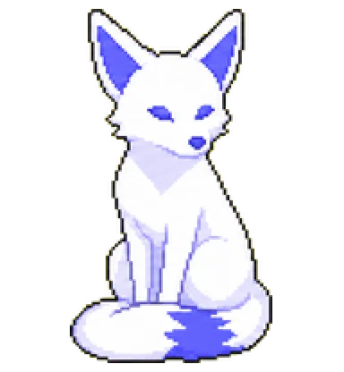<br><sub><b>Nightly Fox</b></sub></a> | <a href="https://codex-pet.com/pets/noctlet"><br><sub><b>Noctlet</b></sub></a> | <a href="https://codex-pet.com/pets/noir-webling"><br><sub><b>Noir Webling</b></sub></a> |
| <a href="https://codex-pet.com/pets/nova-byte"><br><sub><b>Nova Byte</b></sub></a> | <a href="https://codex-pet.com/pets/nukey"><br><sub><b>Nukey</b></sub></a> | <a href="https://codex-pet.com/pets/oo-ee-a-e-a-cat">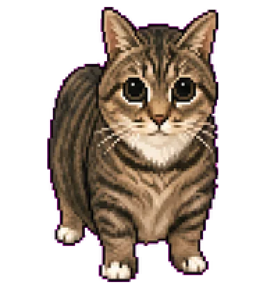<br><sub><b>Oo Ee A E A Cat</b></sub></a> | <a href="https://codex-pet.com/pets/pet"><br><sub><b>OpenVid</b></sub></a> | <a href="https://codex-pet.com/pets/ordek"><br><sub><b>Ördek</b></sub></a> |
| <a href="https://codex-pet.com/pets/peanut"><br><sub><b>Peanut</b></sub></a> | <a href="https://codex-pet.com/pets/pepe"><br><sub><b>Pepe</b></sub></a> | <a href="https://codex-pet.com/pets/phrat"><br><sub><b>PHRAT</b></sub></a> | <a href="https://codex-pet.com/pets/pickle-rick"><br><sub><b>Pickle Rick</b></sub></a> | <a href="https://codex-pet.com/pets/pip-spark"><br><sub><b>Pip Spark</b></sub></a> |
| <a href="https://codex-pet.com/pets/pixel-panda"><br><sub><b>Pixel Panda</b></sub></a> | <a href="https://codex-pet.com/pets/poopy"><br><sub><b>Poopy</b></sub></a> | <a href="https://codex-pet.com/pets/popeye"><br><sub><b>Popeye</b></sub></a> | <a href="https://codex-pet.com/pets/prompt-penguin"><br><sub><b>Prompt Penguin</b></sub></a> | <a href="https://codex-pet.com/pets/punch"><br><sub><b>Punch</b></sub></a> |
| <a href="https://codex-pet.com/pets/quacktop"><br><sub><b>Quacktop</b></sub></a> | <a href="https://codex-pet.com/pets/quill">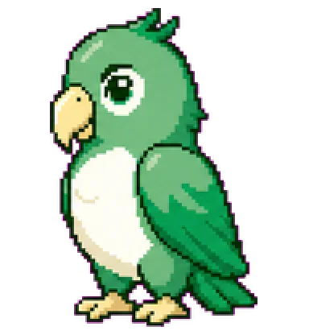<br><sub><b>Quill</b></sub></a> | <a href="https://codex-pet.com/pets/r2-vader"><br><sub><b>r2-vader</b></sub></a> | <a href="https://codex-pet.com/pets/r9"><br><sub><b>R9</b></sub></a> | <a href="https://codex-pet.com/pets/ramapet"><br><sub><b>Ramapet</b></sub></a> |
| <a href="https://codex-pet.com/pets/retriever"><br><sub><b>Retriever</b></sub></a> | <a href="https://codex-pet.com/pets/robocop"><br><sub><b>RoboCop</b></sub></a> | <a href="https://codex-pet.com/pets/rocky">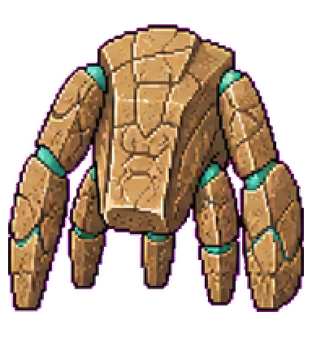<br><sub><b>Rocky</b></sub></a> | <a href="https://codex-pet.com/pets/rocky-2"><br><sub><b>Rocky</b></sub></a> | <a href="https://codex-pet.com/pets/rocky-3">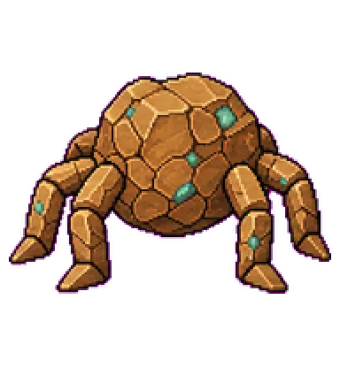<br><sub><b>Rocky</b></sub></a> |
| <a href="https://codex-pet.com/pets/roxy"><br><sub><b>roxy</b></sub></a> | <a href="https://codex-pet.com/pets/sato"><br><sub><b>Sato</b></sub></a> | <a href="https://codex-pet.com/pets/scoop"><br><sub><b>Scoop</b></sub></a> | <a href="https://codex-pet.com/pets/sea-lion"><br><sub><b>Sea Lion</b></sub></a> | <a href="https://codex-pet.com/pets/shelly"><br><sub><b>Shelly</b></sub></a> |
| <a href="https://codex-pet.com/pets/shinchan"><br><sub><b>Shinchan</b></sub></a> | <a href="https://codex-pet.com/pets/shinchan-2"><br><sub><b>Shinchan</b></sub></a> | <a href="https://codex-pet.com/pets/siam"><br><sub><b>Siam</b></sub></a> | <a href="https://codex-pet.com/pets/slayer"><br><sub><b>Slayer</b></sub></a> | <a href="https://codex-pet.com/pets/smoke-kick"><br><sub><b>Smoke Kick</b></sub></a> |
| <a href="https://codex-pet.com/pets/socksy"><br><sub><b>Socksy</b></sub></a> | <a href="https://codex-pet.com/pets/spooky-chase"><br><sub><b>Spooky Chase</b></sub></a> | <a href="https://codex-pet.com/pets/sprig"><br><sub><b>Sprig</b></sub></a> | <a href="https://codex-pet.com/pets/stackbleed-codex-pet"><br><sub><b>StackBleed</b></sub></a> | <a href="https://codex-pet.com/pets/steve"><br><sub><b>Steve</b></sub></a> |
| <a href="https://codex-pet.com/pets/steven"><br><sub><b>Steven</b></sub></a> | <a href="https://codex-pet.com/pets/strawwy"><br><sub><b>strawwy</b></sub></a> | <a href="https://codex-pet.com/pets/swag"><br><sub><b>Swag</b></sub></a> | <a href="https://codex-pet.com/pets/thomas"><br><sub><b>Thomas</b></sub></a> | <a href="https://codex-pet.com/pets/thorfinn"><br><sub><b>Thorfinn</b></sub></a> |
| <a href="https://codex-pet.com/pets/tianyu-dragon">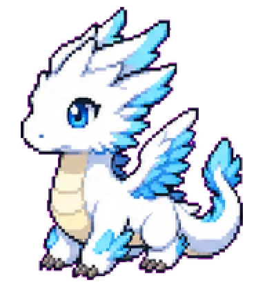<br><sub><b>Tianyu Dragon</b></sub></a> | <a href="https://codex-pet.com/pets/topham"><br><sub><b>Topham</b></sub></a> | <a href="https://codex-pet.com/pets/triple-t-2"><br><sub><b>Triple T</b></sub></a> | <a href="https://codex-pet.com/pets/tuxterm"><br><sub><b>TuxTerm</b></sub></a> | <a href="https://codex-pet.com/pets/unckle-stuart"><br><sub><b>Unckle Stuart</b></sub></a> |
| <a href="https://codex-pet.com/pets/wall-e"><br><sub><b>Wall-E</b></sub></a> | <a href="https://codex-pet.com/pets/wall-e-baby"><br><sub><b>Wall-E Baby</b></sub></a> | <a href="https://codex-pet.com/pets/wojak"><br><sub><b>Wojak</b></sub></a> | <a href="https://codex-pet.com/pets/wukong"><br><sub><b>Wukong</b></sub></a> | <a href="https://codex-pet.com/pets/yamcha"><br><sub><b>Yamcha</b></sub></a> |
| <a href="https://codex-pet.com/pets/yesman"><br><sub><b>Yesman</b></sub></a> | <a href="https://codex-pet.com/pets/zaza"><br><sub><b>Zaza</b></sub></a> | <a href="https://codex-pet.com/pets/zoro"><br><sub><b>Zoro</b></sub></a> | <a href="https://codex-pet.com/pets/tenshi-kaiwai-2"><br><sub><b>天使界隈</b></sub></a> |   |

## How it works

1. The [`codex-pet-cli`](https://www.npmjs.com/package/codex-pet-cli) tool
   pulls a pet's sprite + manifest from [codex-pet.com](https://codex-pet.com) and installs
   it under `~/.codex/pets/`.
2. The [Codex CLI](https://github.com/openai/codex) animates the sprite next
   to your prompt while it works.
3. Each sprite is a 1536×1872 spritesheet of 192×208 frames covering 9
   animation states — see [codex-pet.com](https://codex-pet.com) for the full state grid.

## Credits

Original gallery design and many of the pet assets started life in
[crafter-station/petdex](https://github.com/crafter-station/petdex) (MIT).
This list is an independent fork focused on a friction-free install
experience and hosted at **[codex-pet.com](https://codex-pet.com)**.

## License

[MIT](LICENSE) — pets, thumbnails, and metadata.

---

<p align="center">
  Made with ♥ for the Codex community ·
  <a href="https://codex-pet.com"><strong>codex-pet.com</strong></a>
</p>
