<h1 align="center">Awesome Codex Pets</h1>

<p align="center">
  <em>A community-curated gallery of <strong>590+ animated pets</strong> for the <a href="https://github.com/openai/codex">OpenAI Codex CLI</a>.</em>
</p>

<p align="center">
  <a href="https://codex-pet.com"><strong>codex-pet.com</strong></a>
  &nbsp;·&nbsp;
  <a href="https://codex-pet.com/submit">Submit a pet</a>
  &nbsp;·&nbsp;
  <a href="https://www.npmjs.com/package/codex-pet-cli">codex-pet-cli on npm</a>
</p>

<p align="center">
  Browse the live gallery, animation previews, and one-click installs at
  <a href="https://codex-pet.com"><strong>codex-pet.com</strong></a>.
</p>

---

## Install

Pick a pet from the [gallery](#gallery) below and run:

```bash
npx codex-pet-cli add <slug>
```

The CLI drops the sprite and `pet.json` into `~/.codex/pets/<slug>/` so the
[Codex CLI](https://github.com/openai/codex) picks it up on next launch.

Prefer a manual install? Each pet page has a **Download .zip** button:

```bash
curl -L -o my-pet.zip https://codex-pet.com/api/download/<slug>
unzip my-pet.zip -d ~/.codex/pets/
```

Full per-pet previews — every animation state, tags, and credits — live at
**[codex-pet.com/pets/&lt;slug&gt;](https://codex-pet.com)**.

## Submit your own pet

Designed a pet you want shipped to thousands of Codex users? Submit it at
**[codex-pet.com/submit](https://codex-pet.com/submit)** — sprites are reviewed within a
couple of days and added to both this list and the live gallery.

## Gallery

Click any pet to open its detail page on **[codex-pet.com](https://codex-pet.com)** with the
full animated preview and install command.

| &nbsp; | &nbsp; | &nbsp; | &nbsp; | &nbsp; |
| :---: | :---: | :---: | :---: | :---: |
| <a href="https://codex-pet.com/pets/47"><br><sub><b>47</b></sub></a> | <a href="https://codex-pet.com/pets/ferrari812"><br><sub><b>812</b></sub></a> | <a href="https://codex-pet.com/pets/a-b"><br><sub><b>A-B</b></sub></a> | <a href="https://codex-pet.com/pets/abg"><br><sub><b>ABG</b></sub></a> | <a href="https://codex-pet.com/pets/academicasi"><br><sub><b>AcademicASI</b></sub></a> |
| <a href="https://codex-pet.com/pets/academicasi-2"><br><sub><b>AcademicASI</b></sub></a> | <a href="https://codex-pet.com/pets/acidling"><br><sub><b>Acidling</b></sub></a> | <a href="https://codex-pet.com/pets/ada-lovelace"><br><sub><b>Ada Lovelace</b></sub></a> | <a href="https://codex-pet.com/pets/graycraft6"><br><sub><b>AEGIS // GRAYCRAFT6</b></sub></a> | <a href="https://codex-pet.com/pets/agumon"><br><sub><b>Agumon</b></sub></a> |
| <a href="https://codex-pet.com/pets/airring"><br><sub><b>AirRing</b></sub></a> | <a href="https://codex-pet.com/pets/akane"><br><sub><b>Akane</b></sub></a> | <a href="https://codex-pet.com/pets/aku"><br><sub><b>Aku</b></sub></a> | <a href="https://codex-pet.com/pets/alt-sweetheart"><br><sub><b>Alt Sweetheart</b></sub></a> | <a href="https://codex-pet.com/pets/anakaay-kegare">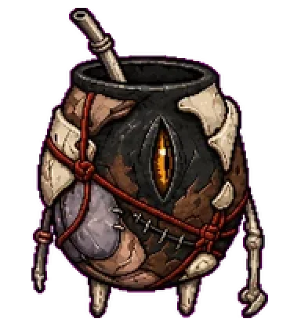<br><sub><b>Añaka’ay Kegare</b></sub></a> |
| <a href="https://codex-pet.com/pets/anathema"><br><sub><b>Anathema</b></sub></a> | <a href="https://codex-pet.com/pets/aoxiaotiger"><br><sub><b>Aoxiao Tiger</b></sub></a> | <a href="https://codex-pet.com/pets/ape-escape"><br><sub><b>Ape Escape Monkey</b></sub></a> | <a href="https://codex-pet.com/pets/apple-flex"><br><sub><b>Apple Flex</b></sub></a> | <a href="https://codex-pet.com/pets/apu-apustaja"><br><sub><b>Apu Apustaja</b></sub></a> |
| <a href="https://codex-pet.com/pets/aqua-wisp"><br><sub><b>Aqua Wisp</b></sub></a> | <a href="https://codex-pet.com/pets/ark01"><br><sub><b>ark01</b></sub></a> | <a href="https://codex-pet.com/pets/asterix"><br><sub><b>Asterix</b></sub></a> | <a href="https://codex-pet.com/pets/awawa-hyrax-2"><br><sub><b>Awawa Hyrax</b></sub></a> | <a href="https://codex-pet.com/pets/axel"><br><sub><b>Axel</b></sub></a> |
| <a href="https://codex-pet.com/pets/axobotl"><br><sub><b>Axobotl</b></sub></a> | <a href="https://codex-pet.com/pets/axobotl-2"><br><sub><b>Axobotl</b></sub></a> | <a href="https://codex-pet.com/pets/baby-milo"><br><sub><b>Baby Milo</b></sub></a> | <a href="https://codex-pet.com/pets/bananboo"><br><sub><b>Bananboo</b></sub></a> | <a href="https://codex-pet.com/pets/banani"><br><sub><b>Banani</b></sub></a> |
| <a href="https://codex-pet.com/pets/bankr"><br><sub><b>Bankr</b></sub></a> | <a href="https://codex-pet.com/pets/bao"><br><sub><b>Bao</b></sub></a> | <a href="https://codex-pet.com/pets/barry"><br><sub><b>Barry</b></sub></a> | <a href="https://codex-pet.com/pets/battle-beast"><br><sub><b>Battle Beast</b></sub></a> | <a href="https://codex-pet.com/pets/lina-belle-2"><br><sub><b>beier</b></sub></a> |
| <a href="https://codex-pet.com/pets/bella"><br><sub><b>Bella</b></sub></a> | <a href="https://codex-pet.com/pets/bernie"><br><sub><b>Bernie</b></sub></a> | <a href="https://codex-pet.com/pets/bipy"><br><sub><b>Bipy</b></sub></a> | <a href="https://codex-pet.com/pets/bitboy"><br><sub><b>BitBoy</b></sub></a> | <a href="https://codex-pet.com/pets/black-dragon-pet"><br><sub><b>Black Dragon</b></sub></a> |
| <a href="https://codex-pet.com/pets/blade"><br><sub><b>Blade</b></sub></a> | <a href="https://codex-pet.com/pets/blau"><br><sub><b>Blau</b></sub></a> | <a href="https://codex-pet.com/pets/bloodseeker"><br><sub><b>Bloodseeker</b></sub></a> | <a href="https://codex-pet.com/pets/boba"><br><sub><b>Boba</b></sub></a> | <a href="https://codex-pet.com/pets/boba-2"><br><sub><b>Boba</b></sub></a> |
| <a href="https://codex-pet.com/pets/bolt"><br><sub><b>Bolt</b></sub></a> | <a href="https://codex-pet.com/pets/bolt-2"><br><sub><b>Bolt</b></sub></a> | <a href="https://codex-pet.com/pets/bonzibuddy"><br><sub><b>BonziBuddy</b></sub></a> | <a href="https://codex-pet.com/pets/boolet"><br><sub><b>Boolet</b></sub></a> | <a href="https://codex-pet.com/pets/boxcat"><br><sub><b>Boxcat</b></sub></a> |
| <a href="https://codex-pet.com/pets/bt-buddy">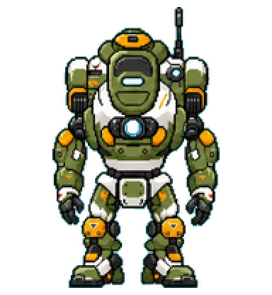<br><sub><b>BT Buddy</b></sub></a> | <a href="https://codex-pet.com/pets/bubu"><br><sub><b>Bubu</b></sub></a> | <a href="https://codex-pet.com/pets/buddhist"><br><sub><b>Buddhist</b></sub></a> | <a href="https://codex-pet.com/pets/buff-patrick"><br><sub><b>Buff Patrick</b></sub></a> | <a href="https://codex-pet.com/pets/bulby"><br><sub><b>Bulby</b></sub></a> |
| <a href="https://codex-pet.com/pets/bumblebee"><br><sub><b>Bumblebee</b></sub></a> | <a href="https://codex-pet.com/pets/byte-bunny"><br><sub><b>Byte Bunny</b></sub></a> | <a href="https://codex-pet.com/pets/cabin-face"><br><sub><b>Cabin</b></sub></a> | <a href="https://codex-pet.com/pets/cache-capy"><br><sub><b>Cache Capy</b></sub></a> | <a href="https://codex-pet.com/pets/caesar"><br><sub><b>Caesar</b></sub></a> |
| <a href="https://codex-pet.com/pets/caesar-2"><br><sub><b>Caesar</b></sub></a> | <a href="https://codex-pet.com/pets/cajal"><br><sub><b>Cajal</b></sub></a> | <a href="https://codex-pet.com/pets/calcifer"><br><sub><b>Calcifer</b></sub></a> | <a href="https://codex-pet.com/pets/calico"><br><sub><b>Calico</b></sub></a> | <a href="https://codex-pet.com/pets/cannibals"><br><sub><b>Cannibals</b></sub></a> |
| <a href="https://codex-pet.com/pets/cantor-sprig"><br><sub><b>Cantor Sprig</b></sub></a> | <a href="https://codex-pet.com/pets/capybaralulu"><br><sub><b>CapybaraLuLu</b></sub></a> | <a href="https://codex-pet.com/pets/carti"><br><sub><b>Carti</b></sub></a> | <a href="https://codex-pet.com/pets/cartman"><br><sub><b>Cartman</b></sub></a> | <a href="https://codex-pet.com/pets/casey-cassette"><br><sub><b>Casey Cassette</b></sub></a> |
| <a href="https://codex-pet.com/pets/cash-cuy"><br><sub><b>Cash Cuy</b></sub></a> | <a href="https://codex-pet.com/pets/cash-cuy-2"><br><sub><b>Cash Cuy</b></sub></a> | <a href="https://codex-pet.com/pets/cerbie"><br><sub><b>Cerbie</b></sub></a> | <a href="https://codex-pet.com/pets/chef"><br><sub><b>Chef</b></sub></a> | <a href="https://codex-pet.com/pets/chiikawa"><br><sub><b>Chiikawa</b></sub></a> |
| <a href="https://codex-pet.com/pets/chikny"><br><sub><b>Chikny</b></sub></a> | <a href="https://codex-pet.com/pets/chillhouse"><br><sub><b>chillhouse</b></sub></a> | <a href="https://codex-pet.com/pets/chirayu"><br><sub><b>Chirayu</b></sub></a> | <a href="https://codex-pet.com/pets/chompers"><br><sub><b>Chompers</b></sub></a> | <a href="https://codex-pet.com/pets/chonk"><br><sub><b>Chonk</b></sub></a> |
| <a href="https://codex-pet.com/pets/graycraft5"><br><sub><b>CHUNK // GRAYCRAFT5</b></sub></a> | <a href="https://codex-pet.com/pets/cicada"><br><sub><b>Cicada</b></sub></a> | <a href="https://codex-pet.com/pets/cicada-2">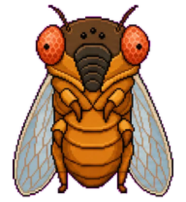<br><sub><b>Cicada</b></sub></a> | <a href="https://codex-pet.com/pets/cinder"><br><sub><b>Cinder</b></sub></a> | <a href="https://codex-pet.com/pets/cinnamonroll"><br><sub><b>Cinnamonroll</b></sub></a> |
| <a href="https://codex-pet.com/pets/clank"><br><sub><b>Clank</b></sub></a> | <a href="https://codex-pet.com/pets/claude-crab"><br><sub><b>Claude Crab</b></sub></a> | <a href="https://codex-pet.com/pets/clawd-2"><br><sub><b>Clawd</b></sub></a> | <a href="https://codex-pet.com/pets/clawdex"><br><sub><b>Clawdex</b></sub></a> | <a href="https://codex-pet.com/pets/clippy"><br><sub><b>Clippy</b></sub></a> |
| <a href="https://codex-pet.com/pets/clippy-3"><br><sub><b>Clippy</b></sub></a> | <a href="https://codex-pet.com/pets/clippy-4"><br><sub><b>Clippy</b></sub></a> | <a href="https://codex-pet.com/pets/clippy-5"><br><sub><b>Clippy</b></sub></a> | <a href="https://codex-pet.com/pets/cloudlet"><br><sub><b>Cloudlet</b></sub></a> | <a href="https://codex-pet.com/pets/cloudy"><br><sub><b>Cloudy Panda</b></sub></a> |
| <a href="https://codex-pet.com/pets/codeberg"><br><sub><b>Codeberg</b></sub></a> | <a href="https://codex-pet.com/pets/codex"><br><sub><b>Codex</b></sub></a> | <a href="https://codex-pet.com/pets/codie"><br><sub><b>Codie</b></sub></a> | <a href="https://codex-pet.com/pets/cogwick"><br><sub><b>Cogwick</b></sub></a> | <a href="https://codex-pet.com/pets/columbinya-2"><br><sub><b>Columbinya</b></sub></a> |
| <a href="https://codex-pet.com/pets/commuai"><br><sub><b>CommuAI</b></sub></a> | <a href="https://codex-pet.com/pets/confucius"><br><sub><b>Confucius</b></sub></a> | <a href="https://codex-pet.com/pets/cool-clippy"><br><sub><b>Cool Clippy</b></sub></a> | <a href="https://codex-pet.com/pets/cortana"><br><sub><b>Cortana</b></sub></a> | <a href="https://codex-pet.com/pets/cow"><br><sub><b>Cow</b></sub></a> |
| <a href="https://codex-pet.com/pets/crab-buddy"><br><sub><b>Crab Buddy</b></sub></a> | <a href="https://codex-pet.com/pets/cosmo"><br><sub><b>Crafternauta</b></sub></a> | <a href="https://codex-pet.com/pets/crash-bandicoot"><br><sub><b>Crash Bandicoot</b></sub></a> | <a href="https://codex-pet.com/pets/cream-cat"><br><sub><b>Cream Cat</b></sub></a> | <a href="https://codex-pet.com/pets/crt-pal"><br><sub><b>CRT Pal</b></sub></a> |
| <a href="https://codex-pet.com/pets/crumbly"><br><sub><b>Crumbly</b></sub></a> | <a href="https://codex-pet.com/pets/cuppy"><br><sub><b>Cuppy</b></sub></a> | <a href="https://codex-pet.com/pets/custard"><br><sub><b>Custard</b></sub></a> | <a href="https://codex-pet.com/pets/cyberholk"><br><sub><b>Cyberholk</b></sub></a> | <a href="https://codex-pet.com/pets/daisy"><br><sub><b>Daisy</b></sub></a> |
| <a href="https://codex-pet.com/pets/danny"><br><sub><b>Danny</b></sub></a> | <a href="https://codex-pet.com/pets/daodun"><br><sub><b>DaoDun</b></sub></a> | <a href="https://codex-pet.com/pets/dave-aitel"><br><sub><b>Dave Aitel</b></sub></a> | <a href="https://codex-pet.com/pets/daxter"><br><sub><b>Daxter</b></sub></a> | <a href="https://codex-pet.com/pets/ddo-zvzo-2"><br><sub><b>ddo-zvzo</b></sub></a> |
| <a href="https://codex-pet.com/pets/decky"><br><sub><b>Decky</b></sub></a> | <a href="https://codex-pet.com/pets/denissexy-itier"><br><sub><b>Denissexy ITier</b></sub></a> | <a href="https://codex-pet.com/pets/dewsnail"><br><sub><b>Dewsnail</b></sub></a> | <a href="https://codex-pet.com/pets/dex-star"><br><sub><b>Dex✦</b></sub></a> | <a href="https://codex-pet.com/pets/diamondhead">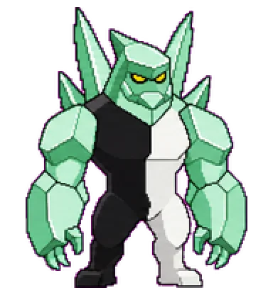<br><sub><b>Diamond Head</b></sub></a> |
| <a href="https://codex-pet.com/pets/ding-ding"><br><sub><b>DING DING</b></sub></a> | <a href="https://codex-pet.com/pets/discopuff"><br><sub><b>Discopuff</b></sub></a> | <a href="https://codex-pet.com/pets/ditta">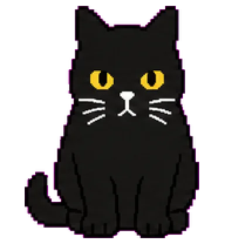<br><sub><b>Ditta</b></sub></a> | <a href="https://codex-pet.com/pets/dobby"><br><sub><b>Dobby</b></sub></a> | <a href="https://codex-pet.com/pets/dobby-2"><br><sub><b>Dobby</b></sub></a> |
| <a href="https://codex-pet.com/pets/dobby-3"><br><sub><b>Dobby</b></sub></a> | <a href="https://codex-pet.com/pets/doodlebob"><br><sub><b>Doodle Bob</b></sub></a> | <a href="https://codex-pet.com/pets/doom-as-a-pet"><br><sub><b>Doom As A Pet</b></sub></a> | <a href="https://codex-pet.com/pets/doomblade">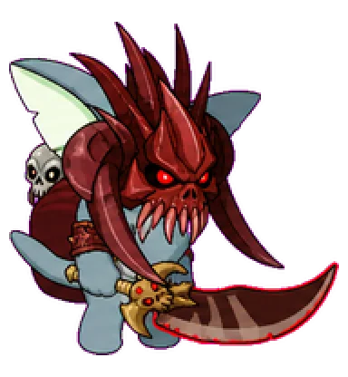<br><sub><b>Doomblade</b></sub></a> | <a href="https://codex-pet.com/pets/doraemon"><br><sub><b>Doraemon</b></sub></a> |
| <a href="https://codex-pet.com/pets/douos-douos"><br><sub><b>DouOS</b></sub></a> | <a href="https://codex-pet.com/pets/drizz"><br><sub><b>Drizz</b></sub></a> | <a href="https://codex-pet.com/pets/druidika"><br><sub><b>Druidika</b></sub></a> | <a href="https://codex-pet.com/pets/dude"><br><sub><b>Dude</b></sub></a> | <a href="https://codex-pet.com/pets/dumpster-fire"><br><sub><b>Dumpster Fire</b></sub></a> |
| <a href="https://codex-pet.com/pets/duo"><br><sub><b>Duo</b></sub></a> | <a href="https://codex-pet.com/pets/eddy"><br><sub><b>Eddy</b></sub></a> | <a href="https://codex-pet.com/pets/eddy-2"><br><sub><b>Eddy</b></sub></a> | <a href="https://codex-pet.com/pets/eddy-3"><br><sub><b>Eddy</b></sub></a> | <a href="https://codex-pet.com/pets/egon-olsen"><br><sub><b>Egon Olsen</b></sub></a> |
| <a href="https://codex-pet.com/pets/eigenblob"><br><sub><b>Eigenblob</b></sub></a> | <a href="https://codex-pet.com/pets/einstein"><br><sub><b>Einstein</b></sub></a> | <a href="https://codex-pet.com/pets/elaina-2"><br><sub><b>Elaina</b></sub></a> | <a href="https://codex-pet.com/pets/elfie"><br><sub><b>Elfie</b></sub></a> | <a href="https://codex-pet.com/pets/elon"><br><sub><b>Elon</b></sub></a> |
| <a href="https://codex-pet.com/pets/90de1b44-3df5-4597-aa30-393619f89d87"><br><sub><b>elon under oath</b></sub></a> | <a href="https://codex-pet.com/pets/elyndex"><br><sub><b>Elyndex</b></sub></a> | <a href="https://codex-pet.com/pets/eminem-brisk"><br><sub><b>Eminem Brisk</b></sub></a> | <a href="https://codex-pet.com/pets/emma">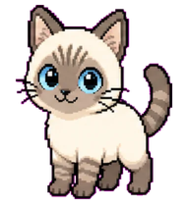<br><sub><b>Emma</b></sub></a> | <a href="https://codex-pet.com/pets/eva01">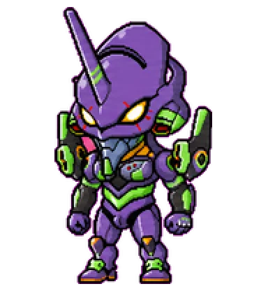<br><sub><b>EVA01</b></sub></a> |
| <a href="https://codex-pet.com/pets/eve"><br><sub><b>EVE</b></sub></a> | <a href="https://codex-pet.com/pets/exec"><br><sub><b>Exec</b></sub></a> | <a href="https://codex-pet.com/pets/fangbyte"><br><sub><b>Fangbyte</b></sub></a> | <a href="https://codex-pet.com/pets/fangjia"><br><sub><b>FangJia</b></sub></a> | <a href="https://codex-pet.com/pets/faye"><br><sub><b>Faye</b></sub></a> |
| <a href="https://codex-pet.com/pets/aiso-feather"><br><sub><b>Feather</b></sub></a> | <a href="https://codex-pet.com/pets/february"><br><sub><b>February</b></sub></a> | <a href="https://codex-pet.com/pets/feynman"><br><sub><b>Feynman</b></sub></a> | <a href="https://codex-pet.com/pets/figaro-2">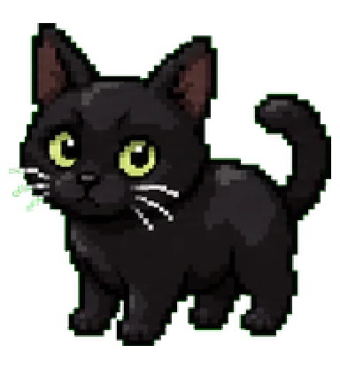<br><sub><b>Figaro</b></sub></a> | <a href="https://codex-pet.com/pets/finderguy"><br><sub><b>Finder Guy</b></sub></a> |
| <a href="https://codex-pet.com/pets/fine-pup"><br><sub><b>Fine Pup</b></sub></a> | <a href="https://codex-pet.com/pets/firebaby"><br><sub><b>Firebaby</b></sub></a> | <a href="https://codex-pet.com/pets/flaskling"><br><sub><b>Flaskling</b></sub></a> | <a href="https://codex-pet.com/pets/floaty"><br><sub><b>Floaty</b></sub></a> | <a href="https://codex-pet.com/pets/foxat"><br><sub><b>Foxat</b></sub></a> |
| <a href="https://codex-pet.com/pets/foxcloud"><br><sub><b>FoxCloud</b></sub></a> | <a href="https://codex-pet.com/pets/freeticket"><br><sub><b>Freeticket</b></sub></a> | <a href="https://codex-pet.com/pets/seth-freshbee"><br><sub><b>freshbee</b></sub></a> | <a href="https://codex-pet.com/pets/friday"><br><sub><b>Friday</b></sub></a> | <a href="https://codex-pet.com/pets/frieren-3"><br><sub><b>Frieren</b></sub></a> |
| <a href="https://codex-pet.com/pets/frieren-4"><br><sub><b>Frieren</b></sub></a> | <a href="https://codex-pet.com/pets/froge-openai-mascot"><br><sub><b>Froge, OpenAI's Mascot</b></sub></a> | <a href="https://codex-pet.com/pets/froggle"><br><sub><b>Froggle</b></sub></a> | <a href="https://codex-pet.com/pets/frosty-codex"><br><sub><b>Frosty Codex</b></sub></a> | <a href="https://codex-pet.com/pets/gabumon">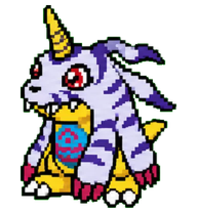<br><sub><b>Gabumon</b></sub></a> |
| <a href="https://codex-pet.com/pets/gallantmon">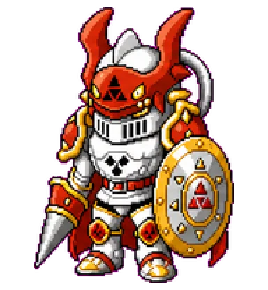<br><sub><b>Gallantmon</b></sub></a> | <a href="https://codex-pet.com/pets/gandalfclassy"><br><sub><b>Gandalf</b></sub></a> | <a href="https://codex-pet.com/pets/ganesh"><br><sub><b>Ganesh</b></sub></a> | <a href="https://codex-pet.com/pets/gat-reaper"><br><sub><b>Gat Reaper</b></sub></a> | <a href="https://codex-pet.com/pets/geats"><br><sub><b>GEATS</b></sub></a> |
| <a href="https://codex-pet.com/pets/ghostface"><br><sub><b>Ghostface</b></sub></a> | <a href="https://codex-pet.com/pets/digimon"><br><sub><b>Gigimon</b></sub></a> | <a href="https://codex-pet.com/pets/gilgamesh-v3"><br><sub><b>gilgamesh-v3</b></sub></a> | <a href="https://codex-pet.com/pets/goblin"><br><sub><b>Goblin</b></sub></a> | <a href="https://codex-pet.com/pets/goblin-sama"><br><sub><b>Goblin Sama</b></sub></a> |
| <a href="https://codex-pet.com/pets/gojo"><br><sub><b>Gojo</b></sub></a> | <a href="https://codex-pet.com/pets/goku-blue"><br><sub><b>Goku Blue</b></sub></a> | <a href="https://codex-pet.com/pets/golden-retriever"><br><sub><b>Golden Retriever</b></sub></a> | <a href="https://codex-pet.com/pets/gopher"><br><sub><b>Gopher</b></sub></a> | <a href="https://codex-pet.com/pets/grace-ashcroft-blue-variant"><br><sub><b>Grace Ashcroft (Blue Variant)</b></sub></a> |
| <a href="https://codex-pet.com/pets/gradient-gob"><br><sub><b>Gradient Gob</b></sub></a> | <a href="https://codex-pet.com/pets/green-monster"><br><sub><b>Green Monster</b></sub></a> | <a href="https://codex-pet.com/pets/gt3rs"><br><sub><b>GT3 RS</b></sub></a> | <a href="https://codex-pet.com/pets/gudako"><br><sub><b>gudako</b></sub></a> | <a href="https://codex-pet.com/pets/digimon-2">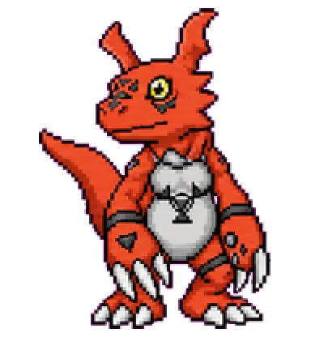<br><sub><b>Guilmon</b></sub></a> |
| <a href="https://codex-pet.com/pets/gukegare"><br><sub><b>Gûkegare</b></sub></a> | <a href="https://codex-pet.com/pets/gutsy"><br><sub><b>Gutsy</b></sub></a> | <a href="https://codex-pet.com/pets/guy"><br><sub><b>Guy</b></sub></a> | <a href="https://codex-pet.com/pets/guybrush"><br><sub><b>Guybrush</b></sub></a> | <a href="https://codex-pet.com/pets/gym-ajussi"><br><sub><b>Gym Ajussi</b></sub></a> |
| <a href="https://codex-pet.com/pets/hachiware"><br><sub><b>Hachiware</b></sub></a> | <a href="https://codex-pet.com/pets/hal"><br><sub><b>HAL</b></sub></a> | <a href="https://codex-pet.com/pets/hal-9000"><br><sub><b>HAL 9000</b></sub></a> | <a href="https://codex-pet.com/pets/hana">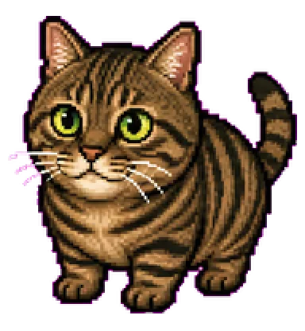<br><sub><b>Hana</b></sub></a> | <a href="https://codex-pet.com/pets/hanami-saki"><br><sub><b>hanami_saki</b></sub></a> |
| <a href="https://codex-pet.com/pets/hannah-montana"><br><sub><b>Hannah Montana</b></sub></a> | <a href="https://codex-pet.com/pets/happy-brush"><br><sub><b>Happy Brush</b></sub></a> | <a href="https://codex-pet.com/pets/happy-brush-2"><br><sub><b>Happy Brush</b></sub></a> | <a href="https://codex-pet.com/pets/happy-cat"><br><sub><b>Happy Cat</b></sub></a> | <a href="https://codex-pet.com/pets/harry-poptart"><br><sub><b>Harry Poptart</b></sub></a> |
| <a href="https://codex-pet.com/pets/harup"><br><sub><b>haruP</b></sub></a> | <a href="https://codex-pet.com/pets/hausdorff-crumb"><br><sub><b>Hausdorff</b></sub></a> | <a href="https://codex-pet.com/pets/hiro-2"><br><sub><b>Hiro</b></sub></a> | <a href="https://codex-pet.com/pets/homie"><br><sub><b>Homie</b></sub></a> | <a href="https://codex-pet.com/pets/huangdou"><br><sub><b>Huangdou</b></sub></a> |
| <a href="https://codex-pet.com/pets/humboldt"><br><sub><b>Humboldt</b></sub></a> | <a href="https://codex-pet.com/pets/huskguin"><br><sub><b>Huskguin</b></sub></a> | <a href="https://codex-pet.com/pets/inari"><br><sub><b>Inari</b></sub></a> | <a href="https://codex-pet.com/pets/invincible-mark"><br><sub><b>Invincible Mark</b></sub></a> | <a href="https://codex-pet.com/pets/invincible-mark-2"><br><sub><b>invincible-mark</b></sub></a> |
| <a href="https://codex-pet.com/pets/itachi"><br><sub><b>Itachi</b></sub></a> | <a href="https://codex-pet.com/pets/izanagi"><br><sub><b>Izanagi</b></sub></a> | <a href="https://codex-pet.com/pets/jane"><br><sub><b>Jane</b></sub></a> | <a href="https://codex-pet.com/pets/java"><br><sub><b>Java</b></sub></a> | <a href="https://codex-pet.com/pets/jeeves"><br><sub><b>Jeeves</b></sub></a> |
| <a href="https://codex-pet.com/pets/island-owner"><br><sub><b>Jeffrey Epstein</b></sub></a> | <a href="https://codex-pet.com/pets/jesus"><br><sub><b>Jesus</b></sub></a> | <a href="https://codex-pet.com/pets/jiangjiang"><br><sub><b>jiangjiang</b></sub></a> | <a href="https://codex-pet.com/pets/jiro"><br><sub><b>jiro</b></sub></a> | <a href="https://codex-pet.com/pets/jollio"><br><sub><b>Jollio</b></sub></a> |
| <a href="https://codex-pet.com/pets/juergen-habermas"><br><sub><b>Juergen Habermas</b></sub></a> | <a href="https://codex-pet.com/pets/aka-shiba"><br><sub><b>July</b></sub></a> | <a href="https://codex-pet.com/pets/jumbo"><br><sub><b>Jumbo</b></sub></a> | <a href="https://codex-pet.com/pets/junie"><br><sub><b>Junie</b></sub></a> | <a href="https://codex-pet.com/pets/zunimog"><br><sub><b>Junimo</b></sub></a> |
| <a href="https://codex-pet.com/pets/justin-bieber"><br><sub><b>Justin Bieber</b></sub></a> | <a href="https://codex-pet.com/pets/kagup"><br><sub><b>kagup!</b></sub></a> | <a href="https://codex-pet.com/pets/kaka"><br><sub><b>Kaka</b></sub></a> | <a href="https://codex-pet.com/pets/kanaria">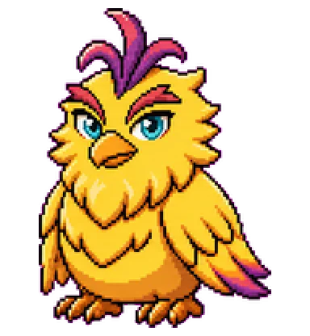<br><sub><b>Kanaria</b></sub></a> | <a href="https://codex-pet.com/pets/kasumi"><br><sub><b>Kasumi</b></sub></a> |
| <a href="https://codex-pet.com/pets/kebo"><br><sub><b>Kebo</b></sub></a> | <a href="https://codex-pet.com/pets/keqing"><br><sub><b>Keqing</b></sub></a> | <a href="https://codex-pet.com/pets/kia-mhalifa"><br><sub><b>Kia Mhalifa</b></sub></a> | <a href="https://codex-pet.com/pets/kibshi"><br><sub><b>KIBSHI</b></sub></a> | <a href="https://codex-pet.com/pets/kiki"><br><sub><b>Kiki</b></sub></a> |
| <a href="https://codex-pet.com/pets/king-charles"><br><sub><b>King Charles</b></sub></a> | <a href="https://codex-pet.com/pets/king-david"><br><sub><b>King David</b></sub></a> | <a href="https://codex-pet.com/pets/kirby"><br><sub><b>Kirby</b></sub></a> | <a href="https://codex-pet.com/pets/kitsune"><br><sub><b>Kitsune</b></sub></a> | <a href="https://codex-pet.com/pets/klein-sip"><br><sub><b>Klein</b></sub></a> |
| <a href="https://codex-pet.com/pets/knotty"><br><sub><b>Knotty</b></sub></a> | <a href="https://codex-pet.com/pets/koda"><br><sub><b>Koda</b></sub></a> | <a href="https://codex-pet.com/pets/koulen"><br><sub><b>koulen。</b></sub></a> | <a href="https://codex-pet.com/pets/kratos-greek"><br><sub><b>Kratos Greek</b></sub></a> | <a href="https://codex-pet.com/pets/kratos-norse">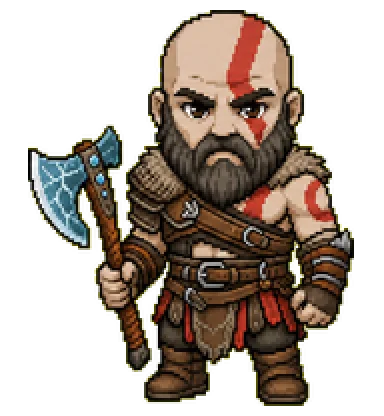<br><sub><b>Kratos Norse</b></sub></a> |
| <a href="https://codex-pet.com/pets/kris-wu"><br><sub><b>Kris wu</b></sub></a> | <a href="https://codex-pet.com/pets/krishna"><br><sub><b>Krishna</b></sub></a> | <a href="https://codex-pet.com/pets/kumakichi-0"><br><sub><b>kumakichi</b></sub></a> | <a href="https://codex-pet.com/pets/kupobyte"><br><sub><b>kupoByte</b></sub></a> | <a href="https://codex-pet.com/pets/kurisu"><br><sub><b>Kurisu</b></sub></a> |
| <a href="https://codex-pet.com/pets/kuro"><br><sub><b>Kuro</b></sub></a> | <a href="https://codex-pet.com/pets/kuro-2">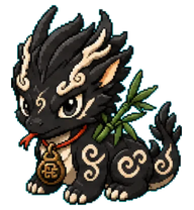<br><sub><b>Kuro</b></sub></a> | <a href="https://codex-pet.com/pets/kuro-love"><br><sub><b>Kuro Love</b></sub></a> | <a href="https://codex-pet.com/pets/claw-crawler"><br><sub><b>kuro-chan</b></sub></a> | <a href="https://codex-pet.com/pets/kuromi"><br><sub><b>Kuromi</b></sub></a> |
| <a href="https://codex-pet.com/pets/kwehlet"><br><sub><b>Kwehlet</b></sub></a> | <a href="https://codex-pet.com/pets/lain"><br><sub><b>Lain</b></sub></a> | <a href="https://codex-pet.com/pets/lain-2"><br><sub><b>Lain</b></sub></a> | <a href="https://codex-pet.com/pets/lampy"><br><sub><b>Lampy</b></sub></a> | <a href="https://codex-pet.com/pets/lando"><br><sub><b>Lando</b></sub></a> |
| <a href="https://codex-pet.com/pets/lando-2"><br><sub><b>Lando</b></sub></a> | <a href="https://codex-pet.com/pets/laozi"><br><sub><b>Laozi</b></sub></a> | <a href="https://codex-pet.com/pets/leafspark"><br><sub><b>Leafspark</b></sub></a> | <a href="https://codex-pet.com/pets/lewis"><br><sub><b>Lewis</b></sub></a> | <a href="https://codex-pet.com/pets/lihua-2"><br><sub><b>Lihua</b></sub></a> |
| <a href="https://codex-pet.com/pets/lil-finder"><br><sub><b>Lil Finder</b></sub></a> | <a href="https://codex-pet.com/pets/linnea-2"><br><sub><b>Linnea</b></sub></a> | <a href="https://codex-pet.com/pets/lint-sprout"><br><sub><b>Lint Sprout</b></sub></a> | <a href="https://codex-pet.com/pets/liuliu"><br><sub><b>liuliu</b></sub></a> | <a href="https://codex-pet.com/pets/longma">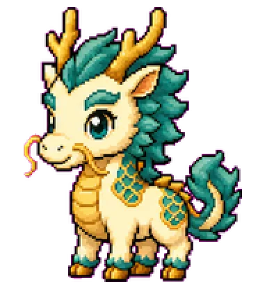<br><sub><b>Longma</b></sub></a> |
| <a href="https://codex-pet.com/pets/longpaopao"><br><sub><b>Longpaopao</b></sub></a> | <a href="https://codex-pet.com/pets/loop"><br><sub><b>Loop</b></sub></a> | <a href="https://codex-pet.com/pets/luffy"><br><sub><b>Luffy</b></sub></a> | <a href="https://codex-pet.com/pets/luffy-2"><br><sub><b>Luffy</b></sub></a> | <a href="https://codex-pet.com/pets/lulu"><br><sub><b>lulu</b></sub></a> |
| <a href="https://codex-pet.com/pets/macintosh"><br><sub><b>Macintosh</b></sub></a> | <a href="https://codex-pet.com/pets/macragge"><br><sub><b>Macragge</b></sub></a> | <a href="https://codex-pet.com/pets/maddie"><br><sub><b>Maddie</b></sub></a> | <a href="https://codex-pet.com/pets/maduro-tech-pet"><br><sub><b>Maduro Tech Pet</b></sub></a> | <a href="https://codex-pet.com/pets/maja"><br><sub><b>Maja</b></sub></a> |
| <a href="https://codex-pet.com/pets/mambo"><br><sub><b>Mambo</b></sub></a> | <a href="https://codex-pet.com/pets/marie"><br><sub><b>Marie</b></sub></a> | <a href="https://codex-pet.com/pets/mariglow"><br><sub><b>Mariglow</b></sub></a> | <a href="https://codex-pet.com/pets/kitmar"><br><sub><b>Marin-chan</b></sub></a> | <a href="https://codex-pet.com/pets/marmalade"><br><sub><b>Marmalade</b></sub></a> |
| <a href="https://codex-pet.com/pets/masked-manager"><br><sub><b>Masked Manager</b></sub></a> | <a href="https://codex-pet.com/pets/max"><br><sub><b>Max</b></sub></a> | <a href="https://codex-pet.com/pets/max-2"><br><sub><b>Max</b></sub></a> | <a href="https://codex-pet.com/pets/max-3"><br><sub><b>Max</b></sub></a> | <a href="https://codex-pet.com/pets/max-4">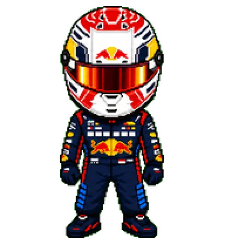<br><sub><b>Max</b></sub></a> |
| <a href="https://codex-pet.com/pets/meridian"><br><sub><b>Meridian</b></sub></a> | <a href="https://codex-pet.com/pets/mettaur"><br><sub><b>Mettaur</b></sub></a> | <a href="https://codex-pet.com/pets/mi-mo"><br><sub><b>Mi-Mo</b></sub></a> | <a href="https://codex-pet.com/pets/mia"><br><sub><b>Mia</b></sub></a> | <a href="https://codex-pet.com/pets/midudev"><br><sub><b>midudev</b></sub></a> |
| <a href="https://codex-pet.com/pets/mika-calico"><br><sub><b>Mika</b></sub></a> | <a href="https://codex-pet.com/pets/milo"><br><sub><b>Milo</b></sub></a> | <a href="https://codex-pet.com/pets/mimi-2"><br><sub><b>Mimi</b></sub></a> | <a href="https://codex-pet.com/pets/mimi-love"><br><sub><b>Mimi Love</b></sub></a> | <a href="https://codex-pet.com/pets/mini-dark-lord"><br><sub><b>Mini Dark Lord</b></sub></a> |
| <a href="https://codex-pet.com/pets/mini-elon"><br><sub><b>Mini Elon</b></sub></a> | <a href="https://codex-pet.com/pets/mini-muse-realistic"><br><sub><b>Mini Muse</b></sub></a> | <a href="https://codex-pet.com/pets/mini-sama"><br><sub><b>Mini Sama</b></sub></a> | <a href="https://codex-pet.com/pets/miraculix"><br><sub><b>Miraculix</b></sub></a> | <a href="https://codex-pet.com/pets/miss-minute"><br><sub><b>Miss Minute</b></sub></a> |
| <a href="https://codex-pet.com/pets/misty">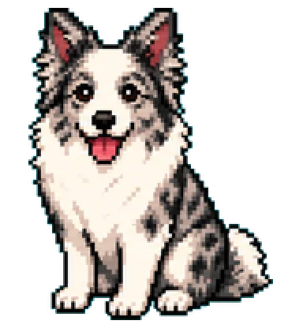<br><sub><b>Misty</b></sub></a> | <a href="https://codex-pet.com/pets/mochi"><br><sub><b>Mochi</b></sub></a> | <a href="https://codex-pet.com/pets/mochi-2"><br><sub><b>Mochi</b></sub></a> | <a href="https://codex-pet.com/pets/mochi-4"><br><sub><b>Mochi</b></sub></a> | <a href="https://codex-pet.com/pets/mog"><br><sub><b>Mog</b></sub></a> |
| <a href="https://codex-pet.com/pets/monica"><br><sub><b>Monica</b></sub></a> | <a href="https://codex-pet.com/pets/monoblossom-hands"><br><sub><b>Monoblossom Hands</b></sub></a> | <a href="https://codex-pet.com/pets/moonlet"><br><sub><b>Moonlet</b></sub></a> | <a href="https://codex-pet.com/pets/morbbit"><br><sub><b>Morbbit</b></sub></a> | <a href="https://codex-pet.com/pets/mordecai"><br><sub><b>Mordecai</b></sub></a> |
| <a href="https://codex-pet.com/pets/mossy"><br><sub><b>Mossy</b></sub></a> | <a href="https://codex-pet.com/pets/mr-game-and-watch"><br><sub><b>Mr Game and Watch</b></sub></a> | <a href="https://codex-pet.com/pets/mysterious-dancing-man"><br><sub><b>Mysterious Dancing Man</b></sub></a> | <a href="https://codex-pet.com/pets/nailong-2"><br><sub><b>Nailong</b></sub></a> | <a href="https://codex-pet.com/pets/naruto"><br><sub><b>Naruto</b></sub></a> |
| <a href="https://codex-pet.com/pets/navi"><br><sub><b>Navi</b></sub></a> | <a href="https://codex-pet.com/pets/nene"><br><sub><b>Nene</b></sub></a> | <a href="https://codex-pet.com/pets/nezuko"><br><sub><b>Nezuko</b></sub></a> | <a href="https://codex-pet.com/pets/nezukocoder"><br><sub><b>NezukoCoder</b></sub></a> | <a href="https://codex-pet.com/pets/nibble"><br><sub><b>Nibble</b></sub></a> |
| <a href="https://codex-pet.com/pets/nibby-2"><br><sub><b>Nibby</b></sub></a> | <a href="https://codex-pet.com/pets/nightcap"><br><sub><b>Nightcap</b></sub></a> | <a href="https://codex-pet.com/pets/nightly-fox"><br><sub><b>Nightly Fox</b></sub></a> | <a href="https://codex-pet.com/pets/nikolaich"><br><sub><b>Nikolaich</b></sub></a> | <a href="https://codex-pet.com/pets/ninjacat"><br><sub><b>Ninjacat</b></sub></a> |
| <a href="https://codex-pet.com/pets/noctlet"><br><sub><b>Noctlet</b></sub></a> | <a href="https://codex-pet.com/pets/noir-webling"><br><sub><b>Noir Webling</b></sub></a> | <a href="https://codex-pet.com/pets/nova">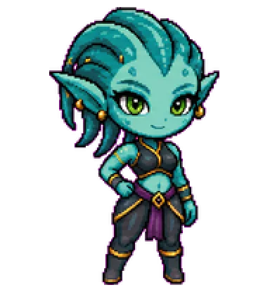<br><sub><b>Nova</b></sub></a> | <a href="https://codex-pet.com/pets/nova-byte"><br><sub><b>Nova Byte</b></sub></a> | <a href="https://codex-pet.com/pets/nukey"><br><sub><b>Nukey</b></sub></a> |
| <a href="https://codex-pet.com/pets/nukie"><br><sub><b>Nukie</b></sub></a> | <a href="https://codex-pet.com/pets/orzeszek"><br><sub><b>Nutty</b></sub></a> | <a href="https://codex-pet.com/pets/nyako-shigure-2"><br><sub><b>Nyako Shigure</b></sub></a> | <a href="https://codex-pet.com/pets/nyami"><br><sub><b>Nyami</b></sub></a> | <a href="https://codex-pet.com/pets/oo-ee-a-e-a-cat"><br><sub><b>Oo Ee A E A Cat</b></sub></a> |
| <a href="https://codex-pet.com/pets/pet"><br><sub><b>OpenVid</b></sub></a> | <a href="https://codex-pet.com/pets/openvid">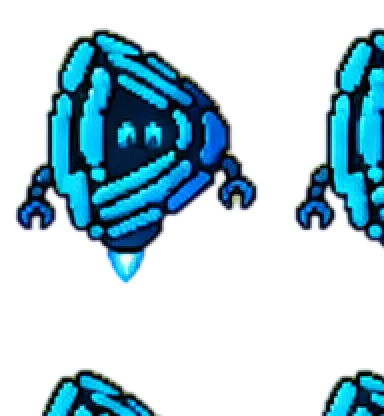<br><sub><b>OpenVid 2</b></sub></a> | <a href="https://codex-pet.com/pets/prime-rig"><br><sub><b>Optimus Prime</b></sub></a> | <a href="https://codex-pet.com/pets/ordek"><br><sub><b>Ördek</b></sub></a> | <a href="https://codex-pet.com/pets/orpheus">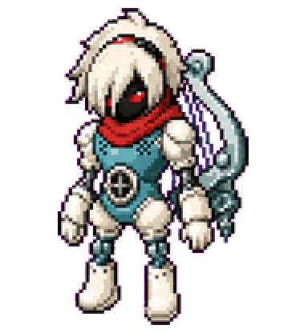<br><sub><b>Orpheus</b></sub></a> |
| <a href="https://codex-pet.com/pets/orpheus-telos">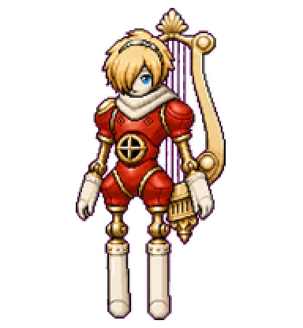<br><sub><b>Orpheus Telos</b></sub></a> | <a href="https://codex-pet.com/pets/ostrom"><br><sub><b>Ostrom</b></sub></a> | <a href="https://codex-pet.com/pets/otto"><br><sub><b>Otto</b></sub></a> | <a href="https://codex-pet.com/pets/painling-2"><br><sub><b>Painling</b></sub></a> | <a href="https://codex-pet.com/pets/pc-guy"><br><sub><b>PC Guy</b></sub></a> |
| <a href="https://codex-pet.com/pets/pc-guy-2"><br><sub><b>PC Guy</b></sub></a> | <a href="https://codex-pet.com/pets/peanut"><br><sub><b>Peanut</b></sub></a> | <a href="https://codex-pet.com/pets/pedro-lapiz"><br><sub><b>Pedro Lapiz</b></sub></a> | <a href="https://codex-pet.com/pets/apupepe"><br><sub><b>Pepe</b></sub></a> | <a href="https://codex-pet.com/pets/pepe"><br><sub><b>Pepe</b></sub></a> |
| <a href="https://codex-pet.com/pets/peri-the-owl"><br><sub><b>Peri the Owl</b></sub></a> | <a href="https://codex-pet.com/pets/peter"><br><sub><b>Peter</b></sub></a> | <a href="https://codex-pet.com/pets/phrat"><br><sub><b>PHRAT</b></sub></a> | <a href="https://codex-pet.com/pets/pickle-rick"><br><sub><b>Pickle Rick</b></sub></a> | <a href="https://codex-pet.com/pets/piggy"><br><sub><b>Piggy</b></sub></a> |
| <a href="https://codex-pet.com/pets/piko"><br><sub><b>Piko</b></sub></a> | <a href="https://codex-pet.com/pets/pimple"><br><sub><b>Pimple</b></sub></a> | <a href="https://codex-pet.com/pets/piney"><br><sub><b>Piney</b></sub></a> | <a href="https://codex-pet.com/pets/pingu"><br><sub><b>Pingu</b></sub></a> | <a href="https://codex-pet.com/pets/pip-spark"><br><sub><b>Pip Spark</b></sub></a> |
| <a href="https://codex-pet.com/pets/pipey"><br><sub><b>Pipey</b></sub></a> | <a href="https://codex-pet.com/pets/pippa"><br><sub><b>Pippa</b></sub></a> | <a href="https://codex-pet.com/pets/pixel"><br><sub><b>Pixel</b></sub></a> | <a href="https://codex-pet.com/pets/pixel-panda"><br><sub><b>Pixel Panda</b></sub></a> | <a href="https://codex-pet.com/pets/piyomon">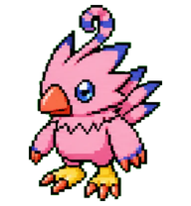<br><sub><b>Piyomon</b></sub></a> |
| <a href="https://codex-pet.com/pets/crittersquest">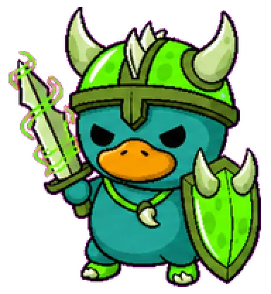<br><sub><b>plat</b></sub></a> | <a href="https://codex-pet.com/pets/plato"><br><sub><b>Plato</b></sub></a> | <a href="https://codex-pet.com/pets/poatan"><br><sub><b>Poatan</b></sub></a> | <a href="https://codex-pet.com/pets/pochita"><br><sub><b>Pochita</b></sub></a> | <a href="https://codex-pet.com/pets/limit-lump"><br><sub><b>Pointling</b></sub></a> |
| <a href="https://codex-pet.com/pets/poopy"><br><sub><b>Poopy</b></sub></a> | <a href="https://codex-pet.com/pets/popeye"><br><sub><b>Popeye</b></sub></a> | <a href="https://codex-pet.com/pets/porter"><br><sub><b>Porter</b></sub></a> | <a href="https://codex-pet.com/pets/powerpet"><br><sub><b>PowerPet</b></sub></a> | <a href="https://codex-pet.com/pets/prabowo"><br><sub><b>Prabowo</b></sub></a> |
| <a href="https://codex-pet.com/pets/prabowo-2"><br><sub><b>Prabowo</b></sub></a> | <a href="https://codex-pet.com/pets/prime-lab"><br><sub><b>Prime Lab</b></sub></a> | <a href="https://codex-pet.com/pets/princess-kako"><br><sub><b>Princess Kako</b></sub></a> | <a href="https://codex-pet.com/pets/pris"><br><sub><b>Pris</b></sub></a> | <a href="https://codex-pet.com/pets/prism"><br><sub><b>Prism</b></sub></a> |
| <a href="https://codex-pet.com/pets/prompt-penguin"><br><sub><b>Prompt Penguin</b></sub></a> | <a href="https://codex-pet.com/pets/punch"><br><sub><b>Punch</b></sub></a> | <a href="https://codex-pet.com/pets/purplewolf"><br><sub><b>purplewolf</b></sub></a> | <a href="https://codex-pet.com/pets/quacktop"><br><sub><b>Quacktop</b></sub></a> | <a href="https://codex-pet.com/pets/quill"><br><sub><b>Quill</b></sub></a> |
| <a href="https://codex-pet.com/pets/r2-vader"><br><sub><b>r2-vader</b></sub></a> | <a href="https://codex-pet.com/pets/r9"><br><sub><b>R9</b></sub></a> | <a href="https://codex-pet.com/pets/rachael"><br><sub><b>Rachael</b></sub></a> | <a href="https://codex-pet.com/pets/ramapet"><br><sub><b>Ramapet</b></sub></a> | <a href="https://codex-pet.com/pets/ramzes"><br><sub><b>Ramzes</b></sub></a> |
| <a href="https://codex-pet.com/pets/raze-mini"><br><sub><b>Raze Mini</b></sub></a> | <a href="https://codex-pet.com/pets/retriever"><br><sub><b>Retriever</b></sub></a> | <a href="https://codex-pet.com/pets/rigby"><br><sub><b>Rigby</b></sub></a> | <a href="https://codex-pet.com/pets/rimuru-2"><br><sub><b>Rimuru</b></sub></a> | <a href="https://codex-pet.com/pets/rio"><br><sub><b>Rio</b></sub></a> |
| <a href="https://codex-pet.com/pets/robocop"><br><sub><b>RoboCop</b></sub></a> | <a href="https://codex-pet.com/pets/rocky"><br><sub><b>Rocky</b></sub></a> | <a href="https://codex-pet.com/pets/rocky-2"><br><sub><b>Rocky</b></sub></a> | <a href="https://codex-pet.com/pets/rocky-3"><br><sub><b>Rocky</b></sub></a> | <a href="https://codex-pet.com/pets/rook"><br><sub><b>Rook</b></sub></a> |
| <a href="https://codex-pet.com/pets/rosalai"><br><sub><b>Rosalai</b></sub></a> | <a href="https://codex-pet.com/pets/roxy"><br><sub><b>roxy</b></sub></a> | <a href="https://codex-pet.com/pets/rubick"><br><sub><b>Rubick</b></sub></a> | <a href="https://codex-pet.com/pets/ruri"><br><sub><b>Ruri</b></sub></a> | <a href="https://codex-pet.com/pets/ruri-2"><br><sub><b>Ruri</b></sub></a> |
| <a href="https://codex-pet.com/pets/rx-78-2-gundam"><br><sub><b>RX-78-2 Gundam</b></sub></a> | <a href="https://codex-pet.com/pets/sabo"><br><sub><b>Sabo</b></sub></a> | <a href="https://codex-pet.com/pets/sam-head"><br><sub><b>Sam Head</b></sub></a> | <a href="https://codex-pet.com/pets/samo"><br><sub><b>Samo</b></sub></a> | <a href="https://codex-pet.com/pets/sandworm-larva"><br><sub><b>Sandworm Larva</b></sub></a> |
| <a href="https://codex-pet.com/pets/sandy-realistic-v2"><br><sub><b>Sandy</b></sub></a> | <a href="https://codex-pet.com/pets/sato"><br><sub><b>Sato</b></sub></a> | <a href="https://codex-pet.com/pets/scoop"><br><sub><b>Scoop</b></sub></a> | <a href="https://codex-pet.com/pets/scorpion"><br><sub><b>Scorpion</b></sub></a> | <a href="https://codex-pet.com/pets/sea-lion"><br><sub><b>Sea Lion</b></sub></a> |
| <a href="https://codex-pet.com/pets/senna"><br><sub><b>Senna</b></sub></a> | <a href="https://codex-pet.com/pets/senna-sprint"><br><sub><b>Senna</b></sub></a> | <a href="https://codex-pet.com/pets/shannon"><br><sub><b>Shannon</b></sub></a> | <a href="https://codex-pet.com/pets/shellbyte"><br><sub><b>Shellbyte</b></sub></a> | <a href="https://codex-pet.com/pets/shelly"><br><sub><b>Shelly</b></sub></a> |
| <a href="https://codex-pet.com/pets/shinchan"><br><sub><b>Shinchan</b></sub></a> | <a href="https://codex-pet.com/pets/shinchan-2"><br><sub><b>Shinchan</b></sub></a> | <a href="https://codex-pet.com/pets/shinobu"><br><sub><b>Shinobu</b></sub></a> | <a href="https://codex-pet.com/pets/shirly"><br><sub><b>shirly</b></sub></a> | <a href="https://codex-pet.com/pets/shiva"><br><sub><b>Shiva</b></sub></a> |
| <a href="https://codex-pet.com/pets/shmutzy"><br><sub><b>Shmutzy</b></sub></a> | <a href="https://codex-pet.com/pets/shoeby">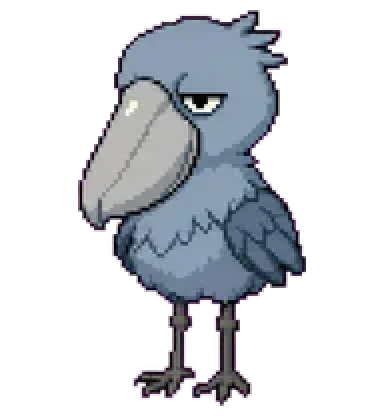<br><sub><b>Shoeby</b></sub></a> | <a href="https://codex-pet.com/pets/shoggoth"><br><sub><b>Shoggoth</b></sub></a> | <a href="https://codex-pet.com/pets/shrimpy"><br><sub><b>Shrimpy</b></sub></a> | <a href="https://codex-pet.com/pets/shujo"><br><sub><b>shujo</b></sub></a> |
| <a href="https://codex-pet.com/pets/siam"><br><sub><b>Siam</b></sub></a> | <a href="https://codex-pet.com/pets/graycraft7"><br><sub><b>SILVER // GRAYCRAFT7</b></sub></a> | <a href="https://codex-pet.com/pets/sima"><br><sub><b>Sima</b></sub></a> | <a href="https://codex-pet.com/pets/skillbit"><br><sub><b>Skillbit</b></sub></a> | <a href="https://codex-pet.com/pets/skirk-2"><br><sub><b>Skirk</b></sub></a> |
| <a href="https://codex-pet.com/pets/sk-ll-and-hati">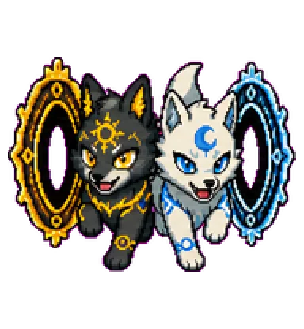<br><sub><b>Sköll and Hati</b></sub></a> | <a href="https://codex-pet.com/pets/sksk"><br><sub><b>sksk</b></sub></a> | <a href="https://codex-pet.com/pets/slay-belle-katarina"><br><sub><b>Slay Belle Katarina</b></sub></a> | <a href="https://codex-pet.com/pets/slayer"><br><sub><b>Slayer</b></sub></a> | <a href="https://codex-pet.com/pets/slayer-2"><br><sub><b>Slayer</b></sub></a> |
| <a href="https://codex-pet.com/pets/smith"><br><sub><b>Smith</b></sub></a> | <a href="https://codex-pet.com/pets/smoke-kick"><br><sub><b>Smoke Kick</b></sub></a> | <a href="https://codex-pet.com/pets/snoopy"><br><sub><b>Snoopy</b></sub></a> | <a href="https://codex-pet.com/pets/snuglet"><br><sub><b>Snuglet</b></sub></a> | <a href="https://codex-pet.com/pets/socksy"><br><sub><b>Socksy</b></sub></a> |
| <a href="https://codex-pet.com/pets/soda"><br><sub><b>Soda</b></sub></a> | <a href="https://codex-pet.com/pets/clawd"><br><sub><b>SolanaSummer</b></sub></a> | <a href="https://codex-pet.com/pets/solanum">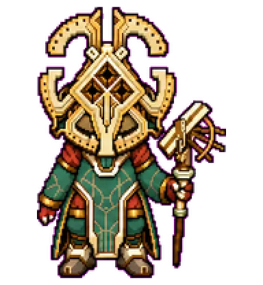<br><sub><b>Solanum</b></sub></a> | <a href="https://codex-pet.com/pets/sora"><br><sub><b>Sora</b></sub></a> | <a href="https://codex-pet.com/pets/spooky-chase"><br><sub><b>Spooky Chase</b></sub></a> |
| <a href="https://codex-pet.com/pets/sprig"><br><sub><b>Sprig</b></sub></a> | <a href="https://codex-pet.com/pets/spyro"><br><sub><b>Spyro</b></sub></a> | <a href="https://codex-pet.com/pets/stackbleed-codex-pet"><br><sub><b>StackBleed</b></sub></a> | <a href="https://codex-pet.com/pets/stan"><br><sub><b>Stan</b></sub></a> | <a href="https://codex-pet.com/pets/steve"><br><sub><b>Steve</b></sub></a> |
| <a href="https://codex-pet.com/pets/steve-jobs"><br><sub><b>Steve Jobs</b></sub></a> | <a href="https://codex-pet.com/pets/steven"><br><sub><b>Steven</b></sub></a> | <a href="https://codex-pet.com/pets/graycraft4"><br><sub><b>STORM // GRAYCRAFT4</b></sub></a> | <a href="https://codex-pet.com/pets/stormy"><br><sub><b>Stormy</b></sub></a> | <a href="https://codex-pet.com/pets/stout-corgi"><br><sub><b>Stout Corgi</b></sub></a> |
| <a href="https://codex-pet.com/pets/strawwy"><br><sub><b>strawwy</b></sub></a> | <a href="https://codex-pet.com/pets/stuff-and-nonsense"><br><sub><b>Stuff & Nonsense</b></sub></a> | <a href="https://codex-pet.com/pets/sukuna"><br><sub><b>Sukuna</b></sub></a> | <a href="https://codex-pet.com/pets/super-piglet"><br><sub><b>Super Piglet</b></sub></a> | <a href="https://codex-pet.com/pets/swag"><br><sub><b>Swag</b></sub></a> |
| <a href="https://codex-pet.com/pets/syntax-drake"><br><sub><b>Syntax Drake</b></sub></a> | <a href="https://codex-pet.com/pets/tachi"><br><sub><b>Tachi</b></sub></a> | <a href="https://codex-pet.com/pets/taffy"><br><sub><b>Taffy</b></sub></a> | <a href="https://codex-pet.com/pets/taolulu"><br><sub><b>TaoLuLu</b></sub></a> | <a href="https://codex-pet.com/pets/taro"><br><sub><b>Taro</b></sub></a> |
| <a href="https://codex-pet.com/pets/tars">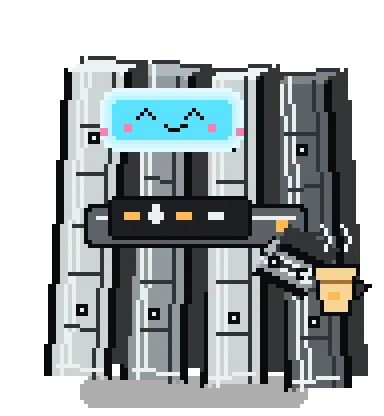<br><sub><b>TARS</b></sub></a> | <a href="https://codex-pet.com/pets/tennis-ball"><br><sub><b>Tennis Ball</b></sub></a> | <a href="https://codex-pet.com/pets/tentomon">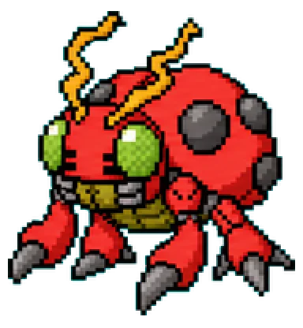<br><sub><b>Tentomon</b></sub></a> | <a href="https://codex-pet.com/pets/terminal"><br><sub><b>Terminal</b></sub></a> | <a href="https://codex-pet.com/pets/terry"><br><sub><b>Terry</b></sub></a> |
| <a href="https://codex-pet.com/pets/the-emperor"><br><sub><b>The Emperor</b></sub></a> | <a href="https://codex-pet.com/pets/thomas"><br><sub><b>Thomas</b></sub></a> | <a href="https://codex-pet.com/pets/thorfinn"><br><sub><b>Thorfinn</b></sub></a> | <a href="https://codex-pet.com/pets/thragg">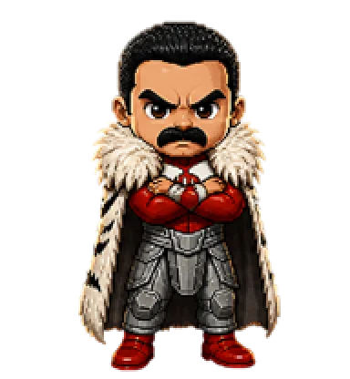<br><sub><b>Thragg</b></sub></a> | <a href="https://codex-pet.com/pets/tian-long"><br><sub><b>Tian Long</b></sub></a> |
| <a href="https://codex-pet.com/pets/tianyu-dragon"><br><sub><b>Tianyu Dragon</b></sub></a> | <a href="https://codex-pet.com/pets/tibo"><br><sub><b>Tibo</b></sub></a> | <a href="https://codex-pet.com/pets/tilly">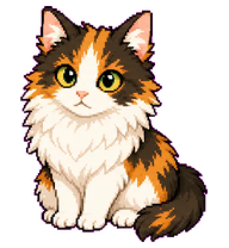<br><sub><b>Tilly</b></sub></a> | <a href="https://codex-pet.com/pets/tiny-ichigo"><br><sub><b>Tiny Ichigo</b></sub></a> | <a href="https://codex-pet.com/pets/tlop-bear"><br><sub><b>TLOP Bear</b></sub></a> |
| <a href="https://codex-pet.com/pets/github-com-ww930912-tony"><br><sub><b>tony</b></sub></a> | <a href="https://codex-pet.com/pets/topham"><br><sub><b>Topham</b></sub></a> | <a href="https://codex-pet.com/pets/torty"><br><sub><b>Torty</b></sub></a> | <a href="https://codex-pet.com/pets/totoro"><br><sub><b>Totoro</b></sub></a> | <a href="https://codex-pet.com/pets/triple-t"><br><sub><b>Triple T</b></sub></a> |
| <a href="https://codex-pet.com/pets/triple-t-2"><br><sub><b>Triple T</b></sub></a> | <a href="https://codex-pet.com/pets/triple-t-3"><br><sub><b>Triple T</b></sub></a> | <a href="https://codex-pet.com/pets/trump"><br><sub><b>Trump</b></sub></a> | <a href="https://codex-pet.com/pets/trumpet"><br><sub><b>Trumpet</b></sub></a> | <a href="https://codex-pet.com/pets/tuxterm"><br><sub><b>TuxTerm</b></sub></a> |
| <a href="https://codex-pet.com/pets/twinklepaws"><br><sub><b>Twinklepaws</b></sub></a> | <a href="https://codex-pet.com/pets/umaru"><br><sub><b>umaru</b></sub></a> | <a href="https://codex-pet.com/pets/umbral"><br><sub><b>Umbral</b></sub></a> | <a href="https://codex-pet.com/pets/unckle-stuart"><br><sub><b>Unckle Stuart</b></sub></a> | <a href="https://codex-pet.com/pets/unit-01">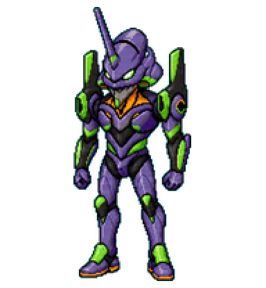<br><sub><b>Unit-01</b></sub></a> |
| <a href="https://codex-pet.com/pets/unknown"><br><sub><b>UNKnOwn</b></sub></a> | <a href="https://codex-pet.com/pets/usagi"><br><sub><b>Usagi</b></sub></a> | <a href="https://codex-pet.com/pets/usagi-2"><br><sub><b>Usagi</b></sub></a> | <a href="https://codex-pet.com/pets/uvn"><br><sub><b>uvn</b></sub></a> | <a href="https://codex-pet.com/pets/vanlife-esme"><br><sub><b>vanlife_esme</b></sub></a> |
| <a href="https://codex-pet.com/pets/vault-boy"><br><sub><b>Vault Boy</b></sub></a> | <a href="https://codex-pet.com/pets/veemon"><br><sub><b>Veemom</b></sub></a> | <a href="https://codex-pet.com/pets/veemon-2"><br><sub><b>Veemom</b></sub></a> | <a href="https://codex-pet.com/pets/vesper"><br><sub><b>Vesper</b></sub></a> | <a href="https://codex-pet.com/pets/violet-mage"><br><sub><b>Violet Mage</b></sub></a> |
| <a href="https://codex-pet.com/pets/viper"><br><sub><b>Viper</b></sub></a> | <a href="https://codex-pet.com/pets/vivi"><br><sub><b>Vivi</b></sub></a> | <a href="https://codex-pet.com/pets/vulcan">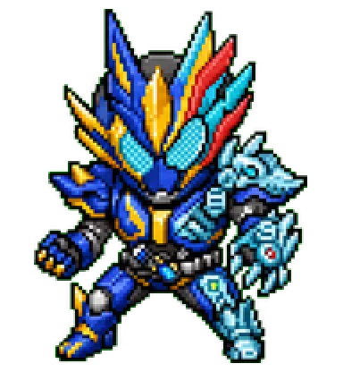<br><sub><b>vulcan</b></sub></a> | <a href="https://codex-pet.com/pets/waley"><br><sub><b>Waley</b></sub></a> | <a href="https://codex-pet.com/pets/wall-e"><br><sub><b>Wall-E</b></sub></a> |
| <a href="https://codex-pet.com/pets/wall-e-2"><br><sub><b>Wall-E</b></sub></a> | <a href="https://codex-pet.com/pets/wall-e-3"><br><sub><b>Wall-E</b></sub></a> | <a href="https://codex-pet.com/pets/wall-e-baby"><br><sub><b>Wall-E Baby</b></sub></a> | <a href="https://codex-pet.com/pets/walter"><br><sub><b>Walter</b></sub></a> | <a href="https://codex-pet.com/pets/wangcai"><br><sub><b>Wangcai</b></sub></a> |
| <a href="https://codex-pet.com/pets/weliwel"><br><sub><b>Weliwel</b></sub></a> | <a href="https://codex-pet.com/pets/wheatley"><br><sub><b>Wheatley</b></sub></a> | <a href="https://codex-pet.com/pets/whip"><br><sub><b>Whip</b></sub></a> | <a href="https://codex-pet.com/pets/white-mage"><br><sub><b>White Mage</b></sub></a> | <a href="https://codex-pet.com/pets/white-muse-realistic"><br><sub><b>White Muse</b></sub></a> |
| <a href="https://codex-pet.com/pets/white-zuccitchi"><br><sub><b>White Zuccitchi</b></sub></a> | <a href="https://codex-pet.com/pets/wifejack"><br><sub><b>Wifejack</b></sub></a> | <a href="https://codex-pet.com/pets/wixie"><br><sub><b>Wixie</b></sub></a> | <a href="https://codex-pet.com/pets/wojak"><br><sub><b>Wojak</b></sub></a> | <a href="https://codex-pet.com/pets/workdou"><br><sub><b>workdou</b></sub></a> |
| <a href="https://codex-pet.com/pets/michael-scott"><br><sub><b>Worlds Best Boss</b></sub></a> | <a href="https://codex-pet.com/pets/wukong"><br><sub><b>Wukong</b></sub></a> | <a href="https://codex-pet.com/pets/wukong-2"><br><sub><b>Wukong</b></sub></a> | <a href="https://codex-pet.com/pets/wukong-3"><br><sub><b>Wukong</b></sub></a> | <a href="https://codex-pet.com/pets/xi-jinping"><br><sub><b>Xi Jinping</b></sub></a> |
| <a href="https://codex-pet.com/pets/xiaobai"><br><sub><b>xiaobai</b></sub></a> | <a href="https://codex-pet.com/pets/xiwei"><br><sub><b>Xiwei</b></sub></a> | <a href="https://codex-pet.com/pets/xxxtentacion"><br><sub><b>XXXTentacion</b></sub></a> | <a href="https://codex-pet.com/pets/yamcha"><br><sub><b>Yamcha</b></sub></a> | <a href="https://codex-pet.com/pets/yaoyu">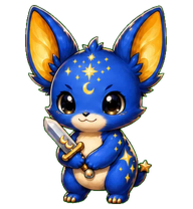<br><sub><b>Yaoyu</b></sub></a> |
| <a href="https://codex-pet.com/pets/yesman"><br><sub><b>Yesman</b></sub></a> | <a href="https://codex-pet.com/pets/yi-er"><br><sub><b>Yi Er</b></sub></a> | <a href="https://codex-pet.com/pets/yinyue">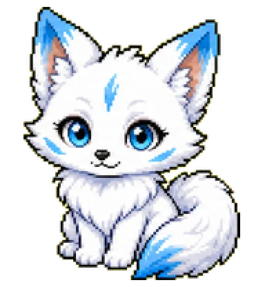<br><sub><b>Yinyue</b></sub></a> | <a href="https://codex-pet.com/pets/younghee-doll"><br><sub><b>Younghee Doll</b></sub></a> | <a href="https://codex-pet.com/pets/yvonne"><br><sub><b>Yvonne</b></sub></a> |
| <a href="https://codex-pet.com/pets/zappy"><br><sub><b>Zappy</b></sub></a> | <a href="https://codex-pet.com/pets/zaza"><br><sub><b>Zaza</b></sub></a> | <a href="https://codex-pet.com/pets/zed"><br><sub><b>Zed</b></sub></a> | <a href="https://codex-pet.com/pets/zeztz-booster">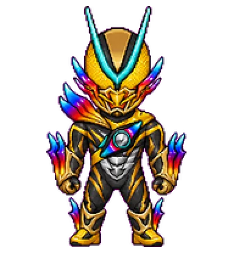<br><sub><b>zeztz booster</b></sub></a> | <a href="https://codex-pet.com/pets/zoro"><br><sub><b>Zoro</b></sub></a> |
| <a href="https://codex-pet.com/pets/daltanyang">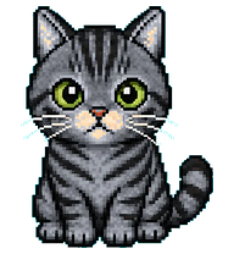<br><sub><b>달타냥</b></sub></a> | <a href="https://codex-pet.com/pets/daltanyang-charles-duo">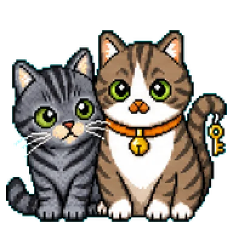<br><sub><b>달타냥과 샤를</b></sub></a> | <a href="https://codex-pet.com/pets/charles">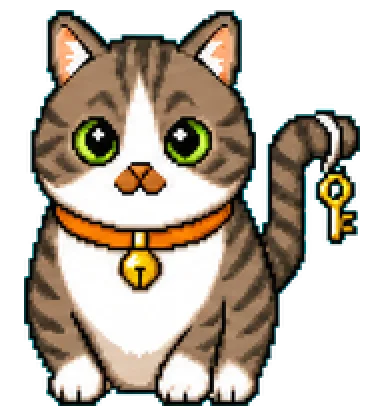<br><sub><b>샤를</b></sub></a> | <a href="https://codex-pet.com/pets/kyle-kun"><br><sub><b>カイルくん</b></sub></a> | <a href="https://codex-pet.com/pets/consento-kun"><br><sub><b>コンセントくん</b></sub></a> |
| <a href="https://codex-pet.com/pets/daodun-dog"><br><sub><b>刀盾狗</b></sub></a> | <a href="https://codex-pet.com/pets/jiyi"><br><sub><b>吉伊</b></sub></a> | <a href="https://codex-pet.com/pets/gugugaga"><br><sub><b>咕咕嘎嘎</b></sub></a> | <a href="https://codex-pet.com/pets/jiaran-2"><br><sub><b>嘉然</b></sub></a> | <a href="https://codex-pet.com/pets/lulu-capybara"><br><sub><b>噜噜</b></sub></a> |
| <a href="https://codex-pet.com/pets/maodie"><br><sub><b>圆头耄耋</b></sub></a> | <a href="https://codex-pet.com/pets/da-zhuang"><br><sub><b>大壮</b></sub></a> | <a href="https://codex-pet.com/pets/da-zhuang-2"><br><sub><b>大壮</b></sub></a> | <a href="https://codex-pet.com/pets/tenshi-kaiwai-2"><br><sub><b>天使界隈</b></sub></a> | <a href="https://codex-pet.com/pets/nailong"><br><sub><b>奶龙</b></sub></a> |
| <a href="https://codex-pet.com/pets/xiaobao">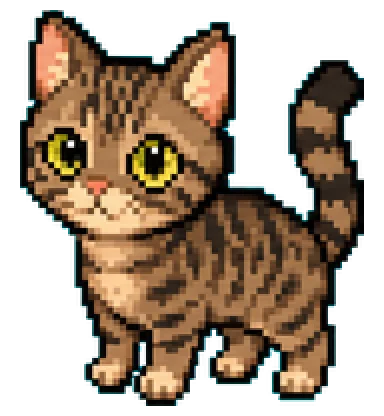<br><sub><b>小豹</b></sub></a> | <a href="https://codex-pet.com/pets/kyojuro-rengoku"><br><sub><b>炼狱杏寿郎</b></sub></a> | <a href="https://codex-pet.com/pets/red-white-gundam">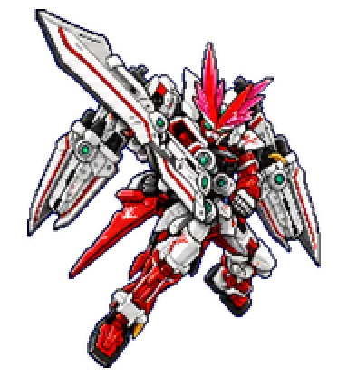<br><sub><b>红白高达</b></sub></a> | <a href="https://codex-pet.com/pets/dopami"><br><sub><b>脳汁ドパミ</b></sub></a> | <a href="https://codex-pet.com/pets/kira"><br><sub><b>贝拉Kira</b></sub></a> |

## How it works

1. The [`codex-pet-cli`](https://www.npmjs.com/package/codex-pet-cli) tool
   pulls a pet's sprite + manifest from [codex-pet.com](https://codex-pet.com) and installs
   it under `~/.codex/pets/`.
2. The [Codex CLI](https://github.com/openai/codex) animates the sprite next
   to your prompt while it works.
3. Each sprite is a 1536×1872 spritesheet of 192×208 frames covering 9
   animation states — see [codex-pet.com](https://codex-pet.com) for the full state grid.

## Credits

Original gallery design and many of the pet assets started life in
[crafter-station/petdex](https://github.com/crafter-station/petdex) (MIT).
This list is an independent fork focused on a friction-free install
experience and hosted at **[codex-pet.com](https://codex-pet.com)**.

## License

[MIT](LICENSE) — pets, thumbnails, and metadata.

---

<p align="center">
  Made with ♥ for the Codex community ·
  <a href="https://codex-pet.com"><strong>codex-pet.com</strong></a>
</p>
